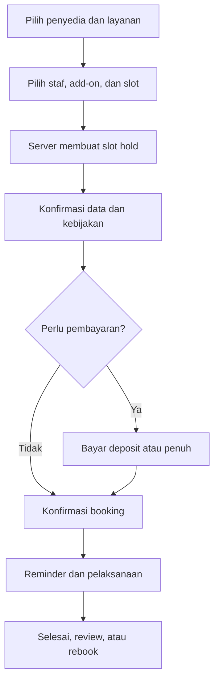
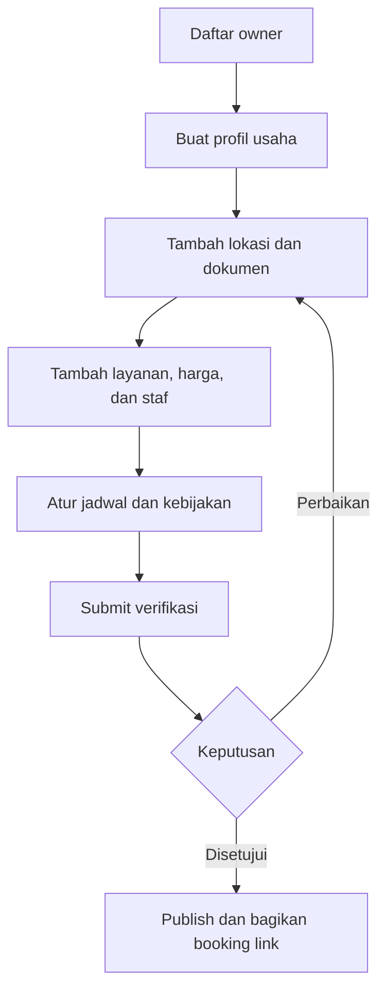
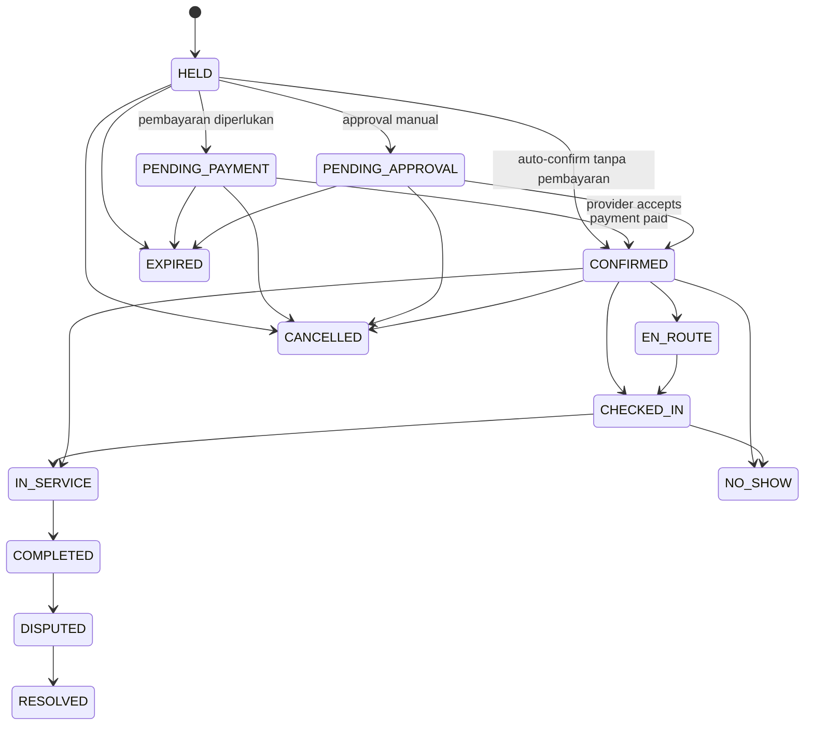
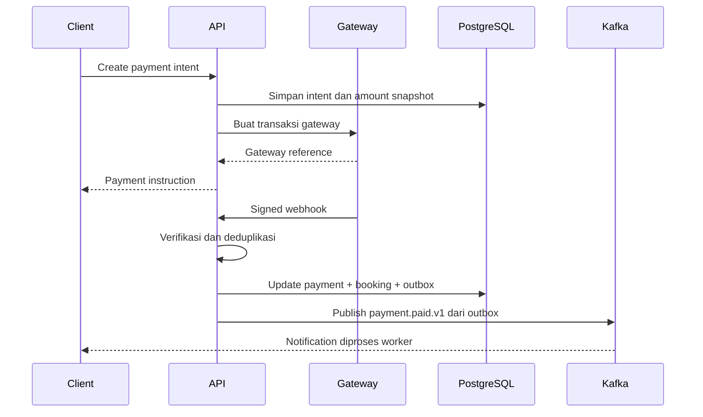
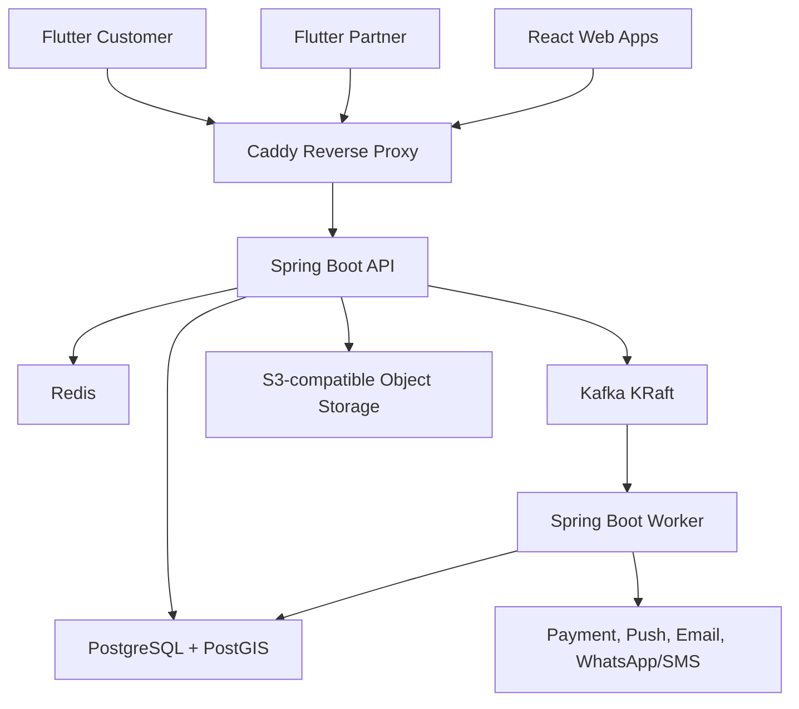
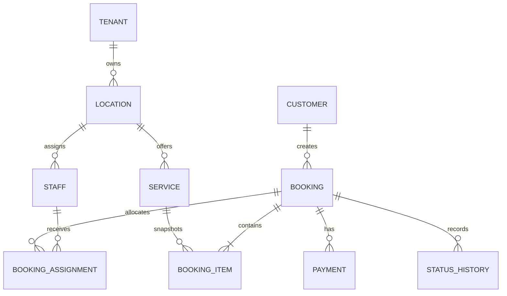
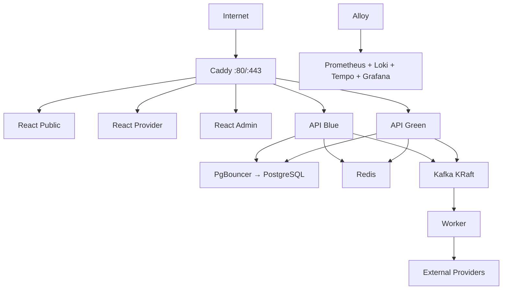

# PRD DEKAT Booking Platform v2.0

**Platform booking layanan dengan harga transparan, jadwal real-time, pembayaran, operasional penyedia, dan marketplace.**

> **Target dokumen:** menjadi acuan bersama untuk product, design, mobile, web, backend, QA, DevOps, security, dan operasional sampai produk dapat dibangun, diuji, dirilis, serta dijalankan pada VPS produksi.

## Daftar Isi Ringkas

- **Produk dan bisnis:** Bagian 1–10.
- **Arsitektur dan kontrak aplikasi:** Bagian 11–17.
- **Data, Redis, Kafka, search, dan media:** Bagian 18–22.
- **Security, SLO, observability, dan testing:** Bagian 23–26.
- **VPS, CI/CD, backup, runbook, dan scaling:** Bagian 27–31.
- **Analytics, release, acceptance, dan go-live:** Bagian 32–41.

## 0. Kontrol Dokumen

| Atribut | Nilai |
|---|---|
| Nama produk | DEKAT Booking Platform |
| Versi PRD | 2.0 |
| Status | Draft siap implementasi |
| Tanggal baseline | 22 Agustus 2026 |
| Target pasar awal | Usaha jasa lokal berbasis appointment |
| Vertikal awal yang direkomendasikan | Barbershop, salon, dan layanan kecantikan |
| Model produk | Provider-first hybrid: SaaS booking + marketplace |
| Mobile | Flutter untuk aplikasi pelanggan dan mitra |
| Web | React + TypeScript + Tailwind CSS |
| Backend | Java + Spring Boot, PostgreSQL, Kafka, Redis |
| Deployment awal | Single VPS production menggunakan Docker Compose |
| Arsitektur awal | Modular monolith event-driven + worker terpisah |
| Availability target | 99,5% per bulan untuk fase single-VPS |

### 0.1 Tujuan dokumen

Dokumen ini mendefinisikan produk jadi yang dituju, bukan menyatakan bahwa source code sudah tersedia. Produk dinyatakan **siap deploy** setelah seluruh persyaratan fungsional, nonfungsional, keamanan, migrasi data, observability, backup, pengujian, dan deployment checklist pada dokumen ini terpenuhi.

### 0.2 Prinsip keputusan

1. PostgreSQL adalah sumber kebenaran untuk booking, pembayaran, jadwal, dan data bisnis.
2. Redis tidak boleh menjadi satu-satunya tempat penyimpanan data bisnis.
3. Kafka digunakan untuk proses asynchronous dan integrasi berbasis event, bukan untuk menggantikan transaksi database.
4. Tidak ada klaim exactly-once lintas sistem; desain menggunakan at-least-once delivery, idempotency, transactional outbox, dan idempotent consumer.
5. Sistem awal menggunakan modular monolith agar sesuai untuk satu VPS dan tim kecil-menengah.
6. Batas modul harus cukup tegas agar modul dapat diekstrak menjadi microservice jika kebutuhan skala terbukti.
7. Semua versi produksi harus dipatok secara eksplisit; tag container `latest` dilarang.
8. Perubahan schema dan API wajib backward-compatible selama proses deployment.

### 0.3 Riwayat perubahan

| Versi | Tanggal | Perubahan |
|---|---|---|
| 1.0 | 22 Agustus 2026 | Marketplace jasa rumah hyperlocal |
| 2.0 | 22 Agustus 2026 | Pivot menjadi platform booking layanan provider-first lengkap dengan spesifikasi teknis dan deployment VPS |

## 1. Ringkasan Eksekutif

DEKAT adalah platform pemesanan layanan yang memungkinkan pelanggan melihat layanan, harga, durasi, staf, lokasi, dan slot waktu yang tersedia sebelum membuat booking. Penyedia jasa memperoleh halaman booking, katalog, kalender, pengelolaan staf, pelanggan, pembayaran, promosi, dan laporan usaha.

Tahap awal tidak bergantung pada marketplace untuk menghasilkan transaksi. Penyedia membawa pelanggan sendiri melalui tautan booking, QR code, WhatsApp, Instagram, Google Business Profile, dan situs mereka. Ketika jumlah penyedia, katalog, dan transaksi telah padat, DEKAT menambahkan discovery marketplace sehingga pelanggan dapat menemukan penyedia baru berdasarkan lokasi, kategori, harga, jadwal, dan reputasi.

Produk terdiri dari lima permukaan utama:

1. **DEKAT Customer Mobile** — aplikasi Flutter untuk pelanggan.
2. **DEKAT Partner Mobile** — aplikasi Flutter untuk pemilik, manajer, dan staf penyedia.
3. **Public Booking Web** — halaman React untuk discovery dan booking tanpa wajib memasang aplikasi.
4. **Provider Portal Web** — dashboard React untuk pengelolaan usaha secara lengkap.
5. **Platform Admin Web** — dashboard React untuk operasi, support, finance, trust, dan konfigurasi platform.

### 1.1 Proposisi nilai

> **Untuk pelanggan:** lihat harga, pilih jadwal, dan booking layanan tanpa chat berulang.

> **Untuk penyedia:** terima booking 24/7, kurangi jadwal bentrok dan no-show, kelola usaha, serta dapatkan pelanggan baru.

### 1.2 Positioning

**DEKAT — Lihat harga. Pilih jadwal. Langsung booking.**

### 1.3 Masalah yang diselesaikan

| Segmen | Masalah | Dampak |
|---|---|---|
| Pelanggan | Harus bertanya harga dan slot melalui chat | Lambat, melelahkan, dan tidak pasti |
| Pelanggan | Tidak memahami durasi, add-on, dan kebijakan pembatalan | Konflik harga dan ekspektasi |
| Penyedia | Booking dicatat manual di chat atau buku | Double booking dan booking terlupakan |
| Penyedia | Tidak ada deposit atau pengingat | No-show dan waktu staf terbuang |
| Penyedia | Riwayat dan preferensi pelanggan tersebar | Sulit meningkatkan repeat booking |
| Pemilik usaha | Tidak melihat utilisasi, pendapatan, dan performa staf | Keputusan usaha berbasis perkiraan |
| Platform | Marketplace dua sisi sulit dimulai dari nol | Biaya akuisisi tinggi dan supply tidak siap |

## 2. Visi, Sasaran, dan Batas Produk

### 2.1 Visi

Menjadi infrastruktur booking utama bagi usaha jasa lokal dan menjadi tempat pertama pelanggan menemukan serta memesan layanan tepercaya.

### 2.2 Sasaran 12 bulan

1. Membuktikan bahwa penyedia aktif menggunakan DEKAT untuk booking milik mereka sendiri.
2. Membuktikan willingness-to-pay untuk paket berlangganan.
3. Mengurangi proses booking manual dan konflik jadwal.
4. Menghasilkan repeat booking tanpa diskon besar.
5. Membentuk supply yang cukup untuk membuka marketplace pada satu vertikal dan wilayah.
6. Menjalankan sistem produksi yang dapat dipantau, dipulihkan, dan diperbarui secara aman pada VPS.

### 2.3 North Star Metric

> **Completed Bookings per Active Provider per Month (CBAPM):** jumlah booking berstatus selesai per penyedia aktif per bulan.

### 2.4 KPI pilot

| KPI | Target awal | Cara ukur |
|---|---:|---|
| Penyedia aktif bulanan | ≥ 20 | Memiliki minimal satu booking selesai dalam 30 hari |
| Booking selesai | ≥ 500 dalam 90 hari | Status `COMPLETED` dan tidak dibatalkan balik |
| Self-service booking | ≥ 50% | Dibuat pelanggan tanpa operator penyedia |
| Booking completion rate | ≥ 90% | Completed dibanding booking confirmed |
| No-show pelanggan | < 8% | Booking confirmed dengan hasil customer no-show |
| Konflik jadwal | 0 booking confirmed yang overlap | Validasi constraint dan laporan operasional |
| Repeat booking 90 hari | ≥ 30% | Pelanggan membuat booking berikutnya |
| Provider willing to pay | ≥ 40% pilot berbayar | Membayar atau menyatakan komitmen paket Pro |
| Payment webhook success | ≥ 99,9% | Event webhook tervalidasi dan diproses |
| API availability | ≥ 99,5% | Synthetic check per menit |

Semua target komersial merupakan hipotesis dan harus disesuaikan setelah discovery.

### 2.5 Non-goals rilis pertama

- Marketplace untuk seluruh jenis jasa secara serentak.
- Renovasi, konstruksi besar, atau proyek tender.
- Payroll lengkap, akuntansi penuh, dan inventori gudang kompleks.
- Dompet elektronik milik DEKAT.
- Penyimpanan data kartu pembayaran.
- Video call dan telemedicine.
- Chat sosial umum antara semua pengguna.
- Dynamic pricing berbasis AI.
- Arsitektur Kubernetes dan puluhan microservice pada fase single-VPS.
- Multi-region active-active.

## 3. Segmen, Persona, dan Jobs to Be Done

### 3.1 Segmen awal

| Segmen | Ciri | Prioritas |
|---|---|---|
| Solo provider | Satu orang, menerima booking melalui WhatsApp | P0 |
| Usaha kecil | 2–10 staf, satu lokasi | P0 |
| Usaha berkembang | 10–50 staf, beberapa lokasi | P1 |
| Chain | Banyak cabang dan manajemen terpusat | P2 |
| Pelanggan lokal | Memesan layanan untuk diri sendiri/keluarga | P0 |
| Platform operator | Verifikasi, support, finance, dan moderation | P0 |

### 3.2 Persona utama

| Persona | Kondisi | Kebutuhan |
|---|---|---|
| Rani, pelanggan | Sibuk dan tidak ingin chat panjang | Harga, slot, booking, pengingat, reschedule |
| Dimas, barber independen | Mengatur booking sendiri | Link booking sederhana, deposit, agenda harian |
| Sinta, pemilik salon | Memiliki 8 staf dan dua cabang | Kalender tim, layanan, laporan, role akses |
| Bayu, staf layanan | Hanya perlu melihat dan memproses jadwalnya | Agenda, check-in, mulai, selesai, catatan |
| Maya, support DEKAT | Menangani booking bermasalah | Timeline, bukti, refund, audit trail |
| Rizal, finance | Rekonsiliasi pembayaran dan komisi | Settlement, invoice, refund, export |

### 3.3 Jobs to Be Done pelanggan

- Ketika membutuhkan layanan, saya ingin mengetahui harga dan ketersediaan agar dapat memesan tanpa menunggu balasan chat.
- Ketika jadwal berubah, saya ingin reschedule sesuai kebijakan tanpa meminta bantuan manual.
- Ketika telah menemukan penyedia yang cocok, saya ingin memesan ulang dengan beberapa langkah.
- Ketika sudah membayar deposit, saya ingin status dan bukti pembayaran yang jelas.
- Ketika layanan bermasalah, saya ingin dukungan dan hasil penyelesaian yang terdokumentasi.

### 3.4 Jobs to Be Done penyedia

- Ketika pelanggan bertanya jadwal, saya ingin mengirim satu link yang selalu menunjukkan slot terbaru.
- Ketika staf mengambil cuti, saya ingin kalender otomatis menutup slot yang terdampak.
- Ketika ada pembatalan, saya ingin slot kembali tersedia dan pelanggan di waitlist dapat diberi tahu.
- Ketika pelanggan tidak datang, saya ingin kebijakan deposit/no-show diterapkan konsisten.
- Ketika menilai usaha, saya ingin melihat booking, utilisasi, pendapatan, repeat rate, dan performa staf.

## 4. Model Bisnis

### 4.1 Model provider-first hybrid

1. Penyedia membuat profil dan katalog.
2. Penyedia membagikan public booking link miliknya.
3. Pelanggan membuat booking tanpa biaya komisi marketplace.
4. DEKAT memperoleh pendapatan dari subscription dan layanan tambahan.
5. Marketplace dibuka ketika supply dan kualitas mencukupi.
6. Booking pelanggan baru dari marketplace dapat dikenakan acquisition fee.

### 4.2 Paket harga hipotesis

| Paket | Harga hipotesis | Cakupan |
|---|---:|---|
| Free | Rp0 | 1 staf, 30 booking/bulan, katalog dasar, link booking |
| Pro | Rp99.000/bulan | 5 staf, booking lebih besar, reminder, deposit, laporan dasar |
| Business | Rp249.000/bulan | 20 staf, multi-lokasi terbatas, role, promo, laporan lanjutan |
| Enterprise | Negosiasi | SSO, cabang besar, SLA, data export, dukungan khusus |

### 4.3 Sumber pendapatan

- Langganan penyedia.
- Acquisition fee 5–10% untuk pelanggan baru dari marketplace.
- Biaya pesan WhatsApp/SMS di atas kuota.
- Sponsored placement yang wajib diberi label.
- Biaya pemrosesan pembayaran sesuai gateway dan perjanjian.
- Add-on laporan, domain khusus, branding, dan onboarding berbayar.

### 4.4 Prinsip komisi

- Booking dari link milik penyedia tidak terkena acquisition fee.
- Atribusi sumber booking disimpan dan dapat diaudit.
- Perubahan biaya harus berlaku prospektif dan diberitahukan.
- Refund komisi mengikuti outcome pembayaran dan kebijakan platform.
- Material atau tip tidak menjadi dasar komisi kecuali dinyatakan eksplisit per kategori.

## 5. Aktor dan Hak Akses

| Aktor | Kemampuan inti |
|---|---|
| Guest | Menjelajah, melihat katalog, harga, slot, dan public booking page |
| Customer | Booking, bayar, reschedule, cancel, review, favorit, dan dukungan |
| Provider Owner | Mengelola seluruh tenant, billing, cabang, staf, katalog, laporan |
| Provider Manager | Mengelola operasional sesuai lokasi yang diberikan |
| Provider Staff | Melihat agenda sendiri dan memproses layanan |
| Front Desk | Membuat booking manual, check-in, pembayaran di tempat |
| Platform Support | Mengelola kasus dan intervensi booking tanpa akses ke secret |
| Platform Trust & Safety | Verifikasi, moderation, suspend, dan incident handling |
| Platform Finance | Payment, refund, settlement, invoice, rekonsiliasi |
| Platform Content | Kategori, banner, FAQ, kebijakan, dan featured listing |
| Platform Admin | Konfigurasi platform terbatas berdasarkan role |
| Super Admin | Break-glass only, seluruh aksi diaudit dan wajib MFA |

### 5.1 Model otorisasi

- RBAC menentukan permission dasar.
- ABAC membatasi tenant, lokasi, booking, dan data pelanggan yang dapat diakses.
- Semua tabel tenant-scoped memiliki `tenant_id`.
- Owner dapat memberi role berbeda per lokasi.
- Staf tidak boleh melihat laporan keuangan jika permission tidak diberikan.
- Support menggunakan masked PII secara default.
- Impersonation hanya untuk support yang berizin, harus memiliki alasan, durasi, dan audit log.

## 6. Permukaan Produk

### 6.1 DEKAT Customer Mobile — Flutter

- Registrasi dan login.
- Discovery penyedia dan layanan.
- Lokasi, filter, favorit, dan recent searches.
- Profil penyedia, layanan, harga, staf, ulasan, dan kebijakan.
- Availability dan booking.
- Deposit/pembayaran.
- Status, pengingat, reschedule, cancellation, rebook.
- Review, dukungan, notifikasi, consent, serta pengaturan akun.

### 6.2 DEKAT Partner Mobile — Flutter

- Onboarding usaha dan verifikasi.
- Agenda hari ini dan kalender.
- Terima/tolak jika manual approval diaktifkan.
- Check-in, en route, mulai, selesai, no-show.
- Blok waktu, cuti, dan quick availability.
- Profil pelanggan dan catatan layanan sesuai izin.
- Pembayaran, ringkasan pendapatan, notifikasi.

### 6.3 Public Booking Web — React

- Landing, kategori, lokasi, discovery, dan SEO-friendly public pages.
- Public booking link per penyedia dan lokasi.
- Booking sebagai guest dengan verifikasi kontak.
- Login opsional untuk menyimpan riwayat.
- Pembayaran, confirmation page, dan deep link ke aplikasi.

### 6.4 Provider Portal Web — React

- Setup usaha, cabang, staf, resource, katalog, dan pricing.
- Kalender harian/mingguan/bulanan.
- Booking desk dan walk-in.
- CRM pelanggan, promo, subscription, finance, dan laporan.
- Role/permission serta audit tenant.

### 6.5 Platform Admin Web — React

- Verifikasi dan moderation penyedia.
- User/tenant/location management.
- Booking operations dan dispute.
- Payment, refund, settlement, subscription.
- Kategori, marketplace, campaign, notification template.
- Feature flag, configuration, audit, dan dashboard operasional.

## 7. Prioritas Rilis

| Prioritas | Definisi |
|---|---|
| P0 | Wajib untuk public production launch |
| P1 | Wajib setelah core stabil; dapat masuk minor release pertama |
| P2 | Optimasi/growth setelah product-market fit |
| Out | Tidak termasuk roadmap saat ini |

### 7.1 Ruang lingkup P0

- Authentication, tenant, role, lokasi, staf.
- Katalog layanan, harga, durasi, add-on.
- Operating hours, time-off, buffer, lead time, booking horizon.
- Availability real-time dan anti-double-booking.
- Booking, deposit, payment webhook, reschedule, cancel, refund dasar.
- Kalender partner, walk-in/manual booking, status execution.
- Push/email notification dan template.
- Public booking web, customer app, partner app, provider portal, admin portal.
- Review, support case, audit log.
- Subscription dasar dan attribution source.
- Observability, backup, security, CI/CD, dan deployment VPS.

### 7.2 Ruang lingkup P1

- Recurring booking.
- Waitlist otomatis.
- Voucher dan loyalty sederhana.
- Multi-location lanjutan.
- Advanced finance and settlement.
- WhatsApp/SMS reminder berbayar.
- Data export terjadwal.
- Provider performance insights.

### 7.3 Ruang lingkup P2

- Membership package pelanggan.
- Gift card.
- Dynamic marketplace ranking experimentation.
- Resource optimization dan recommended slot.
- Automated campaign dan churn prediction.
- Enterprise SSO.
- Open API untuk partner eksternal.

## 8. Persyaratan Fungsional Terperinci

### 8.1 Authentication dan akun

| ID | Pri | Persyaratan | Kriteria penerimaan |
|---|---|---|---|
| AUTH-001 | P0 | Registrasi email/nomor telepon | User dapat membuat akun setelah verifikasi OTP; email/nomor unik per identity type |
| AUTH-002 | P0 | Login password atau OTP | Login berhasil menghasilkan access token pendek dan refresh token terotasi |
| AUTH-003 | P0 | Social login | Google/Apple dapat ditautkan tanpa membuat akun duplikat setelah verifikasi kepemilikan |
| AUTH-004 | P0 | Refresh session | Refresh token sekali pakai; reuse mematikan token family terkait |
| AUTH-005 | P0 | Logout per device/semua device | Session yang dicabut tidak dapat diperbarui lagi |
| AUTH-006 | P0 | Reset credential | Proses memiliki expiry, rate limit, notifikasi, dan audit |
| AUTH-007 | P0 | MFA admin | Semua akun platform admin wajib MFA; recovery code hanya terlihat sekali |
| AUTH-008 | P0 | Device/session list | User dapat melihat device, waktu, IP kasar, dan mencabut session |
| AUTH-009 | P0 | Account lock/rate limit | Brute force dibatasi tanpa memudahkan enumerasi akun |
| AUTH-010 | P1 | Passkey | Dapat ditambahkan sebagai metode login setelah baseline stabil |

### 8.2 Profil pelanggan dan consent

| ID | Pri | Persyaratan | Kriteria penerimaan |
|---|---|---|---|
| CUS-001 | P0 | Profil pelanggan | Nama, avatar opsional, kontak, bahasa, timezone, dan preferensi tersimpan |
| CUS-002 | P0 | Alamat tersimpan | Pelanggan dapat menambah, mengubah, menghapus, dan memilih alamat default |
| CUS-003 | P0 | Preference/notes | Catatan hanya dibagikan kepada penyedia ketika relevan dan disetujui |
| CUS-004 | P0 | Consent versioning | Persetujuan kebijakan menyimpan versi, timestamp, tujuan, dan sumber |
| CUS-005 | P0 | Guest conversion | Riwayat guest booking dapat diklaim setelah verifikasi kontak yang sama |
| CUS-006 | P0 | Export/delete request | Permintaan dicatat, diverifikasi, diproses, dan diaudit sesuai kebijakan retensi |

### 8.3 Discovery dan marketplace

| ID | Pri | Persyaratan | Kriteria penerimaan |
|---|---|---|---|
| MKT-001 | P0 | Pencarian kategori/penyedia | Mendukung nama, kategori, layanan, dan lokasi |
| MKT-002 | P0 | Filter | Lokasi, tanggal, waktu, harga, rating, layanan panggilan, dan gender staf jika sah |
| MKT-003 | P0 | Sort | Relevansi, jarak, slot terdekat, rating, dan harga |
| MKT-004 | P0 | Provider page | Memuat identitas usaha, cabang, katalog, harga, staf, jam, kebijakan, dan ulasan |
| MKT-005 | P0 | Availability preview | Slot terdekat ditampilkan tanpa menjanjikan slot sampai hold berhasil |
| MKT-006 | P0 | Source attribution | Direct/provider link, organic marketplace, campaign, referral, dan admin tercatat |
| MKT-007 | P0 | Sponsored label | Placement berbayar selalu diberi label yang jelas |
| MKT-008 | P1 | Favorite dan recent | Pelanggan dapat menyimpan penyedia dan melihat pencarian terakhir |
| MKT-009 | P1 | Waitlist discovery | Pelanggan dapat bergabung jika tanggal penuh |
| MKT-010 | P2 | Personalization | Rekomendasi hanya memakai consent dan tidak menghilangkan pilihan non-sponsored |

### 8.4 Profil usaha, lokasi, dan verifikasi

| ID | Pri | Persyaratan | Kriteria penerimaan |
|---|---|---|---|
| BUS-001 | P0 | Membuat tenant/usaha | Owner membuat nama, slug, kategori, kontak, dan legal profile |
| BUS-002 | P0 | Verifikasi usaha | Status `DRAFT`, `SUBMITTED`, `UNDER_REVIEW`, `APPROVED`, `REJECTED`, `SUSPENDED` |
| BUS-003 | P0 | Dokumen verifikasi | Upload aman, signed access, expiry, malware scan, dan audit reviewer |
| BUS-004 | P0 | Lokasi/cabang | Alamat, koordinat, timezone, kontak, jam, dan service mode per lokasi |
| BUS-005 | P0 | Public slug | Unik, tervalidasi, mempunyai redirect saat berubah, dan tidak mengambil reserved words |
| BUS-006 | P0 | Branding | Logo, cover, description, gallery, dan social links dengan moderation |
| BUS-007 | P0 | Status publikasi | Profil hanya publik jika syarat minimum dan approval terpenuhi |
| BUS-008 | P1 | Multi-location policy | Owner dapat membatasi manager dan katalog per lokasi |

### 8.5 Katalog, harga, durasi, dan add-on

| ID | Pri | Persyaratan | Kriteria penerimaan |
|---|---|---|---|
| CAT-001 | P0 | Kategori layanan | Provider memilih dari taxonomy platform; custom label tetap dipetakan |
| CAT-002 | P0 | Service | Nama, deskripsi, durasi, harga, tax, deposit, buffer, visibility, dan status |
| CAT-003 | P0 | Price type | `FIXED`, `STARTING_FROM`, `HOURLY`, `PER_UNIT`, `FREE`, `QUOTE_REQUIRED` |
| CAT-004 | P0 | Service variant | Contoh panjang rambut atau level layanan dengan harga dan durasi berbeda |
| CAT-005 | P0 | Add-on | Harga, tambahan durasi, dependency, kuantitas, dan batas maksimum |
| CAT-006 | P0 | Location assignment | Service dapat aktif hanya pada lokasi tertentu |
| CAT-007 | P0 | Staff assignment | Hanya staf yang qualified dapat dipilih/ditugaskan |
| CAT-008 | P0 | Resource requirement | Service dapat membutuhkan kursi, ruangan, alat, atau kapasitas tertentu |
| CAT-009 | P0 | Effective pricing | Perubahan harga mempunyai waktu berlaku dan tidak mengubah booking lama |
| CAT-010 | P0 | Price snapshot | Booking menyimpan nama, harga, tax, fee, durasi, dan kebijakan pada saat checkout |
| CAT-011 | P1 | Package | Beberapa service dapat dijual sebagai paket dengan masa berlaku |
| CAT-012 | P1 | Bulk import/export | CSV tervalidasi dengan preview, error per baris, dan audit |

### 8.6 Staf, resource, dan izin tenant

| ID | Pri | Persyaratan | Kriteria penerimaan |
|---|---|---|---|
| STF-001 | P0 | Invite staf | Invitation memiliki role, lokasi, expiry, dan hanya dapat digunakan sekali |
| STF-002 | P0 | Staff profile | Nama publik, foto, bio, skill, lokasi, status, dan visibility |
| STF-003 | P0 | Service skill | Staf hanya muncul untuk layanan yang ditugaskan |
| STF-004 | P0 | Staff schedule | Jam kerja dapat berbeda per hari dan lokasi |
| STF-005 | P0 | Time-off | Cuti menutup availability dan menandai booking terdampak untuk tindakan |
| STF-006 | P0 | Resource | Resource mempunyai lokasi, kapasitas, jam, maintenance block, dan status |
| STF-007 | P0 | Permission | Aksi lintas role ditolak di backend, bukan hanya disembunyikan di UI |
| STF-008 | P0 | Deactivation | Staf tidak dapat dinonaktifkan tanpa resolusi booking masa depan |
| STF-009 | P1 | Commission per staff | Formula disimpan per periode dan tidak menulis ulang histori |

### 8.7 Scheduling dan availability

| ID | Pri | Persyaratan | Kriteria penerimaan |
|---|---|---|---|
| SCH-001 | P0 | Operating hours | Jam reguler per lokasi dengan timezone IANA |
| SCH-002 | P0 | Availability rule | Rule mingguan per staf/resource dan tanggal efektif |
| SCH-003 | P0 | Exception | Hari libur, special hours, cuti, dan block manual |
| SCH-004 | P0 | Service duration | Total slot = durasi service + add-on + buffer sebelum/sesudah |
| SCH-005 | P0 | Lead time | Booking ditolak jika terlalu dekat dari waktu sekarang |
| SCH-006 | P0 | Booking horizon | Provider menentukan maksimum hari ke depan |
| SCH-007 | P0 | Slot interval | Provider menentukan grid, misalnya 15 atau 30 menit |
| SCH-008 | P0 | Capacity | Slot mempertimbangkan staf, resource, kapasitas, dan booking aktif |
| SCH-009 | P0 | Any available staff | Sistem memilih staf valid secara deterministik dan adil |
| SCH-010 | P0 | Real-time revalidation | Slot selalu divalidasi ulang pada hold dan konfirmasi |
| SCH-011 | P0 | Timezone/DST | Database memakai UTC; display memakai timezone lokasi; ambiguity ditangani eksplisit |
| SCH-012 | P0 | Anti-overlap | Database constraint menolak overlap confirmed/held yang sah |
| SCH-013 | P0 | Cache invalidation | Perubahan jadwal/booking menghapus projection cache terkait |
| SCH-014 | P1 | Arrival window | Mobile service dapat memakai window, travel buffer, dan area layanan |
| SCH-015 | P1 | Recurring rules | Series mendukung weekly/monthly dengan validasi setiap occurrence |

### 8.8 Booking dan checkout

| ID | Pri | Persyaratan | Kriteria penerimaan |
|---|---|---|---|
| BKG-001 | P0 | Create hold | Slot berhasil di-hold sementara atau respons conflict diberikan |
| BKG-002 | P0 | Idempotent create | Retry dengan `Idempotency-Key` sama tidak membuat booking baru |
| BKG-003 | P0 | Quote/price summary | Subtotal, add-on, discount, tax, platform fee, deposit, total terlihat |
| BKG-004 | P0 | Policy acknowledgement | Version cancellation/no-show/provider policy tersimpan pada booking |
| BKG-005 | P0 | Contact verification | Guest wajib memverifikasi kontak sebelum confirmation |
| BKG-006 | P0 | Auto/manual approval | Provider dapat memilih auto-confirm atau manual dengan expiry |
| BKG-007 | P0 | Booking code | Kode mudah dibaca unik secara tenant dan tidak menggantikan UUID internal |
| BKG-008 | P0 | Timeline | Semua transition, actor, reason, dan timestamp dapat dilihat sesuai izin |
| BKG-009 | P0 | Manual/walk-in booking | Front desk dapat membuat booking dan memblokir slot yang sama |
| BKG-010 | P0 | Notes | Public/customer/provider/internal notes dipisah berdasarkan visibility |
| BKG-011 | P0 | Attachments | File dibatasi tipe/ukuran, discan, dan memakai signed URL |
| BKG-012 | P0 | Rebook | Booking baru mengambil template tetapi memakai harga/slot terbaru |
| BKG-013 | P1 | Group/class booking | Kapasitas dikurangi atomik dan tidak overbook |
| BKG-014 | P1 | Waitlist promotion | Slot kosong menghasilkan offer dengan expiry, bukan auto-book tanpa persetujuan |

### 8.9 Pembayaran, deposit, refund, dan settlement

| ID | Pri | Persyaratan | Kriteria penerimaan |
|---|---|---|---|
| PAY-001 | P0 | Payment intent | Dibuat server-side dengan nominal dari price snapshot |
| PAY-002 | P0 | Gateway adapter | Domain tidak bergantung langsung pada bentuk payload satu gateway |
| PAY-003 | P0 | Webhook verification | Signature, timestamp, replay protection, dan allowlist bila relevan diverifikasi |
| PAY-004 | P0 | Webhook idempotency | Event gateway duplikat tidak menggandakan payment/refund |
| PAY-005 | P0 | Payment status | `CREATED`, `PENDING`, `PAID`, `FAILED`, `EXPIRED`, `CANCELLED`, `REFUNDED`, `PARTIAL_REFUND` |
| PAY-006 | P0 | Deposit/full/pay onsite | Metode yang tersedia mengikuti konfigurasi layanan dan risiko |
| PAY-007 | P0 | Payment expiry | Hold dilepas jika pembayaran tidak selesai pada batas waktu |
| PAY-008 | P0 | Refund | Partial/full dengan reason, actor, approval, gateway reference, dan audit |
| PAY-009 | P0 | Reconciliation | Job membandingkan transaksi internal dengan laporan/status gateway |
| PAY-010 | P0 | Receipt | Pelanggan mendapat bukti pembayaran tanpa data kartu sensitif |
| PAY-011 | P0 | Money precision | Nominal disimpan integer minor unit dengan currency ISO 4217 |
| PAY-012 | P1 | Settlement | Komisi, net provider, fee, tax, adjustment, dan payout batch dapat direkonsiliasi |
| PAY-013 | P1 | Invoice subscription | Invoice, due date, payment, failed renewal, grace period, dan suspension |

### 8.10 Pelaksanaan layanan dan status booking

| ID | Pri | Persyaratan | Kriteria penerimaan |
|---|---|---|---|
| OPS-001 | P0 | Agenda staf | Staf hanya melihat booking yang diizinkan dengan detail minimum yang diperlukan |
| OPS-002 | P0 | Confirm/en route | Status hanya tersedia untuk service mode yang sesuai |
| OPS-003 | P0 | Check-in | Dicatat timestamp, actor, dan lokasi hanya jika consent/policy mengizinkan |
| OPS-004 | P0 | Start service | Hanya booking confirmed/check-in valid yang dapat dimulai |
| OPS-005 | P0 | Complete service | Outcome, catatan, actual duration, dan pembayaran akhir harus diselesaikan |
| OPS-006 | P0 | Customer/provider no-show | Actor, bukti, grace period, dan dampak deposit tercatat |
| OPS-007 | P0 | Overtime/add-on | Tambahan wajib disetujui customer sebelum ditagihkan jika meningkatkan harga |
| OPS-008 | P0 | Internal intervention | Support dapat mengubah assignment/status hanya dengan reason dan audit |

### 8.11 Reschedule, cancellation, dan refund policy

| ID | Pri | Persyaratan | Kriteria penerimaan |
|---|---|---|---|
| CAN-001 | P0 | Reschedule customer | Slot baru di-hold sebelum slot lama dilepas; gagal tidak merusak booking lama |
| CAN-002 | P0 | Reschedule provider | Pelanggan diberi pilihan menerima, memilih slot lain, atau refund sesuai policy |
| CAN-003 | P0 | Cancel customer | Fee/refund dihitung dari snapshot kebijakan dan waktu pembatalan |
| CAN-004 | P0 | Cancel provider | Pelanggan tidak dirugikan; replacement/refund path tersedia |
| CAN-005 | P0 | Policy version | Setiap booking memakai version yang disetujui saat konfirmasi |
| CAN-006 | P0 | Reason taxonomy | Reason terstruktur plus catatan opsional dan evidence sesuai kebutuhan |
| CAN-007 | P0 | Slot release | Slot dilepas atomik saat status final pembatalan tercapai |
| CAN-008 | P0 | Refund consistency | Booking, payment, refund, ledger, dan notification konsisten melalui workflow |

### 8.12 Notifikasi

| ID | Pri | Persyaratan | Kriteria penerimaan |
|---|---|---|---|
| NTF-001 | P0 | Channel | Push dan email P0; WhatsApp/SMS adapter-ready |
| NTF-002 | P0 | Template versioning | Template memiliki locale, version, variables, preview, dan approval |
| NTF-003 | P0 | Event-driven delivery | Request dikirim melalui Kafka dan diproses worker idempotent |
| NTF-004 | P0 | Reminder | H-24/H-2 dapat dikonfigurasi per tenant dalam batas platform |
| NTF-005 | P0 | Preference | Marketing opt-in terpisah; transactional notification tidak dicampur |
| NTF-006 | P0 | Delivery log | Provider response, retry, failure, dan correlation ID tersimpan |
| NTF-007 | P0 | Quiet hours | Marketing tunduk pada quiet hours; reminder kritis mengikuti policy |
| NTF-008 | P1 | WhatsApp quota | Penggunaan dan biaya tenant dapat diukur serta dibatasi |

### 8.13 Review, support, dan dispute

| ID | Pri | Persyaratan | Kriteria penerimaan |
|---|---|---|---|
| REV-001 | P0 | Verified review | Hanya customer dengan booking completed yang dapat review |
| REV-002 | P0 | Review dimensions | Rating keseluruhan, ketepatan waktu, kualitas, dan komentar |
| REV-003 | P0 | Provider response | Satu respons publik yang dapat dimoderasi dan diedit dengan histori |
| REV-004 | P0 | Moderation | Report, hide, reinstate, reason, actor, dan audit |
| SUP-001 | P0 | Create case | Booking/payment/account case memiliki nomor, severity, owner, SLA, dan timeline |
| SUP-002 | P0 | Evidence | Lampiran aman dan akses dibatasi pada pihak terkait |
| SUP-003 | P0 | Resolution | Refund, credit, no action, warning, replacement, atau escalation tercatat |
| SUP-004 | P0 | SLA | P0 segera; P1 ≤ 4 jam; P2 ≤ 1 hari kerja; P3 ≤ 2 hari kerja sebagai target awal |

### 8.14 CRM, promo, dan repeat booking

| ID | Pri | Persyaratan | Kriteria penerimaan |
|---|---|---|---|
| CRM-001 | P0 | Customer list | Tenant hanya melihat pelanggan yang pernah berinteraksi dengannya |
| CRM-002 | P0 | Booking history | Riwayat terbatas pada tenant dan permission yang benar |
| CRM-003 | P0 | Internal note | Note memiliki author, timestamp, visibility, dan audit |
| CRM-004 | P1 | Segment | First-time, repeat, inactive, high-value berdasarkan definisi terdokumentasi |
| PRM-001 | P1 | Coupon | Code, period, quota, eligibility, benefit, stack rule, dan audit |
| PRM-002 | P1 | Campaign | Targeting hanya menggunakan consent yang sah |
| PRM-003 | P1 | Loyalty | Point/visit reward mempunyai ledger immutable dan expiry |
| CRM-005 | P1 | Recurring reminder | Berdasarkan service history dan dapat dimatikan pelanggan |

### 8.15 Subscription dan entitlements

| ID | Pri | Persyaratan | Kriteria penerimaan |
|---|---|---|---|
| SUB-001 | P0 | Plan catalog | Limit dan feature entitlement versioned |
| SUB-002 | P0 | Usage metering | Booking, staf, lokasi, pesan, dan storage dapat dihitung |
| SUB-003 | P0 | Upgrade | Entitlement aktif setelah pembayaran/approval dan dapat diaudit |
| SUB-004 | P0 | Downgrade | Berlaku akhir periode; konflik limit harus diselesaikan |
| SUB-005 | P0 | Grace period | Kegagalan bayar tidak langsung menghapus data atau booking |
| SUB-006 | P0 | Cancellation | Akses berbayar berakhir sesuai periode; export tetap tersedia sesuai kebijakan |
| SUB-007 | P1 | Trial | Satu trial per tenant identity dengan anti-abuse |

### 8.16 Laporan penyedia

| ID | Pri | Persyaratan | Kriteria penerimaan |
|---|---|---|---|
| RPT-001 | P0 | Overview | Booking, completion, cancellation, no-show, revenue, dan repeat |
| RPT-002 | P0 | Date/location/staff filter | Semua agregasi mengikuti timezone lokasi dan permission |
| RPT-003 | P0 | Export | CSV asynchronous, signed URL, expiry, dan audit |
| RPT-004 | P1 | Utilization | Booked service time dibanding available service time |
| RPT-005 | P1 | Attribution | Direct, marketplace, referral, campaign, dan manual |
| RPT-006 | P1 | Performance | Staf/service metrics tanpa ranking yang diskriminatif atau tidak transparan |

### 8.17 Platform admin dan konfigurasi

| ID | Pri | Persyaratan | Kriteria penerimaan |
|---|---|---|---|
| ADM-001 | P0 | Global search | User, tenant, booking, payment, case dengan permission dan masked PII |
| ADM-002 | P0 | Provider verification | Checklist, evidence, reviewer, decision, reason, dan history |
| ADM-003 | P0 | Booking intervention | Reassign/status override/refund melalui workflow, tidak direct DB edit |
| ADM-004 | P0 | Category management | Taxonomy versioned; deactivation tidak merusak historical data |
| ADM-005 | P0 | Feature flags | Target environment/tenant/percentage, owner, expiry, dan audit |
| ADM-006 | P0 | Config management | Validasi, versioning, approval untuk setting sensitif |
| ADM-007 | P0 | Audit viewer | Filter actor/action/resource/date/correlation; export terbatas |
| ADM-008 | P0 | Suspend/reactivate | Reason, scope, notice, open booking handling, dan appeal |
| ADM-009 | P0 | Notification templates | Preview, test send, approval, rollback |
| ADM-010 | P1 | Marketplace curation | Featured/sponsored/category landing dengan disclosure |

## 9. Flow Produk

### 9.1 Flow booking pelanggan



### 9.2 Flow onboarding penyedia



### 9.3 Booking state machine



### 9.4 Flow reschedule atomik

1. Client mengirim booking ID, target slot, expected version, dan idempotency key.
2. Server memverifikasi actor, policy, status, serta target slot.
3. Server mengunci aggregate booking dan kapasitas target.
4. Server membuat reservation target dalam satu transaksi.
5. Jika target berhasil, reservation lama dilepas dan timeline ditulis.
6. Jika target gagal, booking lama tidak berubah.
7. Outbox event `booking.rescheduled.v1` dibuat dalam transaksi yang sama.
8. Cache availability lama dan baru diinvalidate.
9. Worker mengirim notifikasi kepada pihak terkait.

### 9.5 Flow pembayaran



### 9.6 Flow pembatalan dan refund

1. Actor memilih alasan pembatalan.
2. Backend mengambil policy snapshot yang terikat pada booking.
3. Backend menghitung fee, refundable amount, dan pihak penanggung.
4. Actor melihat hasil sebelum konfirmasi jika pembatalan dilakukan pelanggan/provider.
5. Booking masuk state pembatalan yang sesuai.
6. Refund dibuat idempotent dan diproses melalui gateway.
7. Slot dilepas hanya setelah perubahan booking berhasil.
8. Ledger, payment, refund, outbox, audit, dan timeline diperbarui.
9. Jika refund gateway gagal, kasus masuk retry dan alert finance; booking tidak dikembalikan ke status aktif.

### 9.7 Flow layanan harian partner

1. Staf membuka agenda hari ini.
2. Staf melihat data minimum pelanggan dan instruksi layanan.
3. Untuk layanan panggilan, staf memilih `EN_ROUTE`.
4. Front desk/staf melakukan check-in.
5. Staf memulai layanan.
6. Add-on berbayar memerlukan persetujuan pelanggan.
7. Staf menyelesaikan layanan dan mencatat outcome.
8. Sistem menagih sisa pembayaran bila ada.
9. Pelanggan menerima bukti serta permintaan review.

## 10. Aturan Bisnis Utama

### 10.1 Aturan harga

- Semua nominal berasal dari server dan price snapshot.
- Client tidak dipercaya untuk menghitung harga final.
- Harga `STARTING_FROM` wajib memberi penjelasan apa yang dapat mengubah nilai.
- `QUOTE_REQUIRED` tidak dapat dibayar final sebelum quote disetujui.
- Add-on yang menambah durasi harus memicu validasi slot ulang.
- Perubahan katalog tidak mengubah booking yang telah confirmed.
- Discount tidak boleh membuat total negatif.
- Rounding dilakukan satu kali pada tahap yang terdokumentasi.

### 10.2 Aturan jadwal

- Waktu disimpan dalam UTC dan lokasi menyimpan timezone IANA.
- Slot dianggap tersedia hanya setelah validasi database.
- Availability cache bersifat hint; hasil cache tidak menjamin booking.
- Hold default 10 menit dan configurable dalam batas platform.
- Booking manual, walk-in, dan online memakai constraint yang sama.
- Booking yang membutuhkan beberapa resource harus berhasil semuanya atau rollback semuanya.
- Perubahan jam kerja harus mendeteksi booking terdampak dan meminta resolusi.

### 10.3 Aturan pembatalan awal

| Kondisi | Perlakuan hipotesis |
|---|---|
| >24 jam sebelum jadwal | Refund penuh deposit |
| 4–24 jam | Refund sebagian atau satu kali reschedule |
| <4 jam | Deposit dapat hangus sesuai kebijakan yang disetujui |
| Provider membatalkan | Refund penuh; prioritas replacement |
| Customer no-show | Deposit dapat hangus setelah grace period |
| Provider no-show | Refund penuh dan incident provider |

Kebijakan akhir harus dapat dikonfigurasi per kategori/tenant dalam batas kebijakan platform dan hukum yang berlaku.

### 10.4 Aturan ulasan

- Hanya satu review utama per booking.
- Review dapat diedit dalam jangka waktu terbatas dengan histori internal.
- Provider tidak dapat menghapus review.
- Moderation hanya berdasarkan kebijakan, bukan karena nilai rendah.
- Rating marketplace menggunakan minimum sample dan Bayesian smoothing agar provider baru tidak dirugikan.

### 10.5 Aturan marketplace ranking

Sinyal yang boleh dipakai:

- Kecocokan kategori dan layanan.
- Jarak/area layanan.
- Slot terdekat.
- Completion rate.
- No-show/cancellation provider.
- Rating terverifikasi dan jumlah review.
- Responsiveness untuk booking manual approval.
- Sponsored boost yang diberi label.

Ranking tidak boleh menggunakan atribut sensitif atau sinyal yang tidak dapat dijelaskan secara internal.

## 11. Arsitektur Sistem

### 11.1 Gaya arsitektur

Backend dibangun sebagai **modular monolith event-driven** dengan dua deployment unit dari codebase backend yang sama:

1. `dekat-api` menangani REST API, authentication, commands, queries, serta webhook synchronous.
2. `dekat-worker` menangani Kafka consumers, notifikasi, export, reconciliation, cache projection, dan pekerjaan asynchronous.

Modul domain berkomunikasi melalui API internal yang eksplisit dan domain event. Direct access ke repository modul lain dilarang. Spring Modulith digunakan untuk memverifikasi batas modul dan dependency cycle.

### 11.2 Alasan tidak langsung microservices

- Transaksi booking, slot, dan pembayaran membutuhkan konsistensi tinggi.
- Satu VPS tidak memberi isolation atau high availability nyata untuk banyak service.
- Operasi, tracing, deployment, dan debugging lebih sederhana.
- Kafka dan outbox tetap membentuk kontrak event untuk ekstraksi service kelak.
- Modul notification, search, reporting, dan payment worker merupakan kandidat ekstraksi pertama.

### 11.3 Diagram konteks



### 11.4 Modul domain backend

| Modul | Tanggung jawab | Data yang dimiliki |
|---|---|---|
| Identity | User, credential, OTP, session, MFA, social identity | `users`, `identities`, `sessions`, `mfa_factors` |
| Access Control | Roles, permissions, assignments, policy | `roles`, `permissions`, `role_assignments` |
| Tenant | Business, location, branding, verification | `tenants`, `businesses`, `locations`, `verifications` |
| Staff | Staff, skills, role tenant, resources | `staff`, `staff_services`, `resources` |
| Catalog | Category, service, variant, add-on, price | `categories`, `services`, `variants`, `addons`, `price_versions` |
| Scheduling | Hours, rules, exception, time-off, slot projection | `availability_rules`, `schedule_exceptions`, `time_off` |
| Booking | Hold, booking, assignment, timeline, reschedule | `bookings`, `booking_items`, `assignments`, `status_history` |
| Payment | Intent, transaction, refund, ledger, settlement | `payments`, `refunds`, `ledger_entries`, `settlements` |
| Subscription | Plan, entitlement, usage, invoice | `plans`, `subscriptions`, `usage_counters`, `invoices` |
| Customer | Tenant customer profile, consent, notes | `customers`, `customer_tenant_links`, `consents`, `customer_notes` |
| Marketplace | Search projection, attribution, ranking input | `marketplace_profiles`, `booking_attributions` |
| Review | Review, response, report, moderation | `reviews`, `review_responses`, `review_reports` |
| Promotion | Coupon, campaign, redemption, loyalty ledger | `coupons`, `campaigns`, `redemptions`, `loyalty_entries` |
| Notification | Template, preference, delivery request/log | `notification_templates`, `preferences`, `deliveries` |
| Support | Case, evidence, SLA, resolution | `support_cases`, `case_events`, `case_attachments` |
| Reporting | Aggregates, export request, projection | `daily_metrics`, `export_jobs` |
| Media | Metadata, ownership, scanning, signed access | `media_objects` |
| Audit | Security/business audit trail | `audit_logs` |
| Platform Config | Feature flag dan configuration version | `feature_flags`, `config_versions` |

### 11.5 Dependency rules

- `Booking` boleh menggunakan public API `Catalog`, `Scheduling`, `Customer`, dan `Tenant`.
- `Payment` tidak mengubah booking melalui repository; ia memanggil application command atau menghasilkan event.
- `Notification` tidak boleh menjadi dependency transaksi core.
- `Reporting` membaca event/projection dan tidak dipanggil dari transaksi booking.
- `Marketplace` tidak menguasai availability; ia meminta query scheduling.
- `Audit` menerima metadata melalui interceptor/event tanpa menyimpan secret atau payload sensitif penuh.
- Semua modul harus lolos module boundary test dan no-cycle verification.

## 12. Baseline Teknologi Produksi

Baseline ini diverifikasi pada 22 Agustus 2026. Patch version harus diperbarui sebelum code freeze jika tersedia security fix yang kompatibel.

| Area | Baseline | Keputusan |
|---|---|---|
| Mobile SDK | Flutter stable 3.44.7 | Gunakan stable channel; evaluasi 3.47 hanya setelah resmi stable dan regression test |
| Mobile language | Dart yang dibundel Flutter | Tidak memasang Dart terpisah dari Flutter baseline |
| Java | JDK 25 production/LTS vendor build | Tidak memakai preview feature untuk core domain |
| Backend framework | Spring Boot 4.1.1 | Spring Framework 7.0.9+ sesuai requirement resmi |
| Build backend | Gradle 9.x + wrapper | Wrapper dipatok dan diverifikasi checksum |
| Modular architecture | Spring Modulith stable yang kompatibel dengan Boot 4.1 | Tidak memakai snapshot/milestone |
| API | Spring MVC, Jakarta Validation, springdoc/OpenAPI compatible | MVC dipilih karena domain dominan blocking I/O dan JDBC |
| Database | PostgreSQL 18.6 | Current supported production release |
| Geospatial | PostGIS compatible with PostgreSQL 18 | Nearby search dan service area |
| Migration | Flyway stable compatible | Semua DDL melalui migration versioned |
| Connection pool | HikariCP + PgBouncer | Pool aplikasi kecil dan pooling VPS terkontrol |
| Event streaming | Apache Kafka 4.3.1, KRaft | Official image dipatok; tanpa ZooKeeper |
| Cache | Redis 8.2 GA | Dipilih karena lifecycle/EOL yang lebih jelas; evaluasi 8.8 setelah compatibility test |
| Web runtime | Node.js 24.19 LTS | Build/runtime SSR; tidak memakai Node Current untuk produksi |
| Web UI | React 19.2.x patched | Minimal security-patched line; hindari vulnerable release |
| Web language | TypeScript latest stable compatible | Strict mode, no implicit any |
| Web build | Vite 8.1 | Build React apps dan public SSR/prerender |
| Web styling | Tailwind CSS 4.3 | Design tokens dan accessible component primitives |
| Container | Docker Engine 29.7.2 | Rootless bila feasible; image dipatok digest |
| Orchestration VPS | Docker Compose Specification / Compose v5 | Production override dan profiles |
| Edge | Caddy 2.11+ | Reverse proxy, static file, automatic HTTPS |
| Object storage | S3-compatible storage | Self-hosted pada VPS atau external bucket melalui adapter |
| Observability | OpenTelemetry + Grafana Alloy | Logs, metrics, traces melalui OTLP |
| Metrics | Prometheus | Scrape internal, tidak publik |
| Logs | Loki | Structured JSON logs dengan retention |
| Traces | Tempo | Sampling berbasis environment dan error |
| Dashboard | Grafana | Internal only, authentication wajib |
| Backup | pgBackRest + offsite S3-compatible | Full/incremental, WAL archive, restore drill |

### 12.1 Kebijakan versi

- Production image memakai exact semantic version dan digest.
- Dependabot/Renovate membuat PR upgrade, tidak auto-deploy ke production.
- Security patch high/critical ditargetkan ≤72 jam setelah tervalidasi.
- Major upgrade harus memiliki ADR, compatibility test, migration plan, dan rollback plan.
- Flutter dan native SDK dipatok melalui FVM serta lockfile.
- JavaScript memakai `pnpm-lock.yaml` dengan frozen install di CI.
- Gradle dependency locking diaktifkan untuk backend.
- SBOM CycloneDX/SPDX dibuat pada setiap release.

## 13. Struktur Repository

Pendekatan awal adalah monorepo agar perubahan kontrak API, mobile, web, backend, dan infra dapat direview atomik.

```text
dekat-platform/
  apps/
    mobile_customer/          # Flutter customer
    mobile_partner/           # Flutter partner
    web_public/               # React public booking + marketplace
    web_provider/             # React provider portal
    web_admin/                # React platform admin
  packages/
    flutter_core/
    flutter_design_system/
    flutter_api_client/
    web_ui/
    web_api_client/
    web_config/
  services/
    platform_backend/
      src/main/java/id/dekat/
        identity/
        access/
        tenant/
        staff/
        catalog/
        scheduling/
        booking/
        payment/
        subscription/
        customer/
        marketplace/
        review/
        promotion/
        notification/
        support/
        reporting/
        media/
        audit/
      src/main/resources/db/migration/
  contracts/
    openapi/
    events/
    examples/
  infra/
    compose/
    caddy/
    postgres/
    kafka/
    redis/
    observability/
    backup/
    scripts/
  docs/
    adr/
    runbooks/
    security/
    product/
  .github/workflows/
```

### 13.1 Branch dan release

- Trunk-based development dengan short-lived branches.
- Pull request wajib review dan status checks.
- `main` selalu deployable ke staging.
- Release menggunakan tag `vMAJOR.MINOR.PATCH`.
- Mobile memakai build number terpisah per platform.
- Database migration tidak boleh diubah setelah pernah masuk environment bersama; buat migration baru.

## 14. Arsitektur Flutter

### 14.1 Aplikasi

| Aplikasi | Package ID contoh | Target |
|---|---|---|
| DEKAT Customer | `id.dekat.customer` | Android dan iOS |
| DEKAT Partner | `id.dekat.partner` | Android dan iOS |

### 14.2 Struktur feature-first

```text
lib/
  app/
    bootstrap/
    routing/
    theme/
  core/
    auth/
    network/
    storage/
    telemetry/
    localization/
  features/
    authentication/
    discovery/
    provider_profile/
    availability/
    booking/
    payment/
    notification/
    support/
    account/
```

Setiap feature memisahkan:

- `presentation`: screen, widget, controller/state.
- `application`: use case dan orchestration.
- `domain`: entity/value object/interface.
- `data`: DTO, mapper, remote/local data source.

### 14.3 Library dan pola Flutter

| Kebutuhan | Pilihan |
|---|---|
| State management | Riverpod stable compatible, provider code generation bila matang |
| Navigation | `go_router` dengan typed route/deep link |
| HTTP | `dio` dengan interceptor auth, retry terkontrol, correlation ID |
| Model | Immutable model + JSON code generation (`freezed`/`json_serializable` compatible) |
| Secure storage | Keychain/Keystore melalui secure storage plugin |
| Local cache | SQLite/Drift untuk read cache dan draft; bukan source of truth booking |
| Push | Firebase Cloud Messaging/APNs abstraction |
| Crash | Crash reporting provider abstraction dan symbol upload |
| Analytics | Event taxonomy internal; consent-aware |
| Localization | `intl`, bahasa Indonesia default, English-ready |
| Feature flag | Remote config melalui backend, dengan safe default lokal |

Versi package pihak ketiga dipilih pada implementation kickoff, wajib stable, kompatibel dengan Flutter baseline, dan dipatok dalam lockfile.

### 14.4 Mobile network behavior

- Access token hanya disimpan di secure storage.
- Refresh token tidak boleh ditulis ke log atau analytics.
- Automatic retry hanya untuk request aman/idempotent.
- POST booking/payment memakai idempotency key yang tetap saat retry.
- Timeout connect 10 detik, read 30 detik sebagai baseline; payment dapat berbeda.
- Offline mode hanya menampilkan cache/draft; booking tidak dianggap berhasil sebelum server confirmation.
- Error UI membedakan validation, conflict slot, unauthorized, rate limit, gateway outage, dan offline.
- Semua response penting membawa `request_id` untuk support.

### 14.5 Deep link dan push

- Public booking URL membuka aplikasi jika terpasang, web jika tidak.
- Push booking membuka detail booking yang sesuai setelah authorization check.
- Deep link tidak boleh mempercayai tenant/booking hanya dari parameter.
- Notification payload tidak membawa PII sensitif.
- Token FCM/APNs terkait user, device, app, environment, dan dapat dicabut.

### 14.6 Mobile quality bar

- Android minimum mengikuti dukungan Flutter stable dan kebutuhan pasar; keputusan dicatat di ADR.
- iOS minimum mengikuti dukungan Flutter stable serta kebijakan App Store.
- Startup p75 ≤2,5 detik pada perangkat target menengah setelah warm install.
- Frame jank dipantau; critical journey harus mempertahankan frame budget perangkat.
- Screen reader, scalable text, contrast, focus order, dan touch target diuji.
- Tidak ada secret, private key, atau admin endpoint di bundle aplikasi.

## 15. Arsitektur Web React + Tailwind

### 15.1 Pembagian aplikasi

- `web_public`: React Router framework/SSR atau prerender untuk halaman publik dan SEO; hydration untuk booking interaktif.
- `web_provider`: SPA authenticated untuk operasional penyedia.
- `web_admin`: SPA authenticated yang dipisahkan bundle, domain, policy, dan permission.

### 15.2 Stack web

| Area | Pilihan |
|---|---|
| UI runtime | React 19.2 patched |
| Language | TypeScript strict |
| Build | Vite 8.1 |
| Styling | Tailwind CSS 4.3 |
| Routing | React Router stable compatible |
| Server state | TanStack Query stable compatible |
| Form | React Hook Form + Zod stable compatible |
| UI primitives | Accessible headless primitives; wrapper internal di `web_ui` |
| Tables | Virtualized only untuk data besar; pagination server-side default |
| Tests | Vitest, Testing Library, Playwright |
| Package manager | pnpm stable pinned melalui Corepack |

### 15.3 Design system

- Token: color, typography, spacing, radius, elevation, motion, z-index.
- Tailwind mengonsumsi CSS variables, bukan warna hard-coded di setiap page.
- Komponen inti: button, input, select, combobox, date/time picker, dialog, drawer, toast, table, pagination, skeleton, empty/error state.
- Komponen booking harus mendukung keyboard dan screen reader.
- Status tidak boleh dibedakan hanya dengan warna.
- Web menargetkan WCAG 2.2 AA.

### 15.4 Web security

- Web memakai server-managed session dalam `Secure`, `HttpOnly`, `SameSite=Lax` cookie; canonical session tersimpan di PostgreSQL dengan Redis sebagai cache. BFF terpisah tidak diperlukan pada MVP.
- Mutation web wajib membawa CSRF token yang diikat ke session.
- JWT/refresh token mobile tidak disimpan di `localStorage` atau diekspos ke JavaScript web.
- Content Security Policy, HSTS, `X-Content-Type-Options`, `Referrer-Policy`, dan frame restriction diterapkan di Caddy/app.
- CORS hanya mengizinkan origin yang eksplisit per environment.
- Source map production tidak publik; disimpan di crash reporting/CI artifact terproteksi.
- Dependency vulnerable line tidak boleh diluncurkan.

### 15.5 SEO public web

- Unique title, description, canonical URL, OpenGraph, dan structured data yang relevan.
- Sitemap provider/location yang publik.
- Noindex untuk checkout, account, admin, dan duplicate query pages.
- Slug redirect 301 setelah perubahan.
- Provider yang suspended tidak tampil dan URL memberi status yang sesuai tanpa membocorkan alasan internal.

## 16. Arsitektur Backend Java Spring

### 16.1 Runtime dan framework

- Java 25, Spring Boot 4.1.1, Spring Framework 7.0.9+.
- Spring MVC untuk REST synchronous.
- Spring Security OAuth2 Resource Server/JWT semantics untuk access token.
- Spring Data JDBC/JPA dipilih per aggregate; query kompleks boleh memakai jOOQ stable compatible.
- Spring Kafka untuk producer/consumer.
- Spring Modulith untuk module boundaries, module test, dan event observability.
- Bean Validation untuk command boundary.
- Flyway untuk database migration.
- Actuator untuk health, readiness, metrics, dan info yang disanitasi.

### 16.2 Layer per modul

```text
module/
  api/             # public module contracts, commands, queries, events
  application/     # use cases, transaction orchestration
  domain/          # aggregate, entity, value object, policy
  infrastructure/  # persistence, Kafka, Redis, external adapters
  web/             # REST controller dan DTO
```

### 16.3 Transaction boundary

- Satu application command menguasai satu database transaction.
- External HTTP call tidak dilakukan di dalam transaction kecuali alasan kuat dan timeout ketat.
- Payment intent memakai persistence-before-call dan reconciliation.
- Domain update dan outbox event ditulis pada transaction yang sama.
- Consumer melakukan deduplication sebelum side effect.
- Optimistic locking memakai `version`; critical slot memakai database exclusion/lock.

### 16.4 Authentication design

- Flutter memakai short-lived JWT access token dan rotating opaque refresh token.
- React web memakai server-managed session cookie; identity, role, dan authorization policy tetap sama dengan mobile.
- Access token JWT maksimal 15 menit.
- Refresh token opaque, high-entropy, disimpan dalam bentuk hash, dirotasi setiap penggunaan.
- Session menyimpan device, issued/expiry, last seen, revoked reason, dan token family.
- Password memakai Argon2id dengan parameter yang dibenchmark pada hardware produksi.
- OTP disimpan hash di Redis dengan TTL, attempt counter, cooldown, dan destination normalization.
- Admin MFA memakai TOTP/passkey; SMS bukan faktor utama admin.
- Key rotation mempunyai `kid`, overlap period, dan runbook.

### 16.5 Authorization design

- Endpoint menyatakan permission eksplisit.
- Service layer memverifikasi tenant dan ownership, tidak hanya controller.
- PostgreSQL RLS digunakan pada tabel tenant-kritis sebagai defense in depth.
- Background job membawa tenant context yang tervalidasi.
- Admin break-glass role dinonaktifkan secara default, time-bound, dan diaudit.

### 16.6 External integration adapters

| Port domain | Adapter awal |
|---|---|
| PaymentGateway | Midtrans/Xendit/DOKU dipilih setelah procurement; webhook adapter per provider |
| PushGateway | Firebase Cloud Messaging dan APNs |
| EmailGateway | SMTP/provider transactional email |
| MessagingGateway | WhatsApp Business/SMS provider adapter |
| ObjectStorage | S3-compatible API |
| Geocoding/Maps | Provider adapter; koordinat canonical disimpan setelah validasi |
| MalwareScanner | ClamAV service atau scanning provider |
| ErrorReporting | Provider abstraction; PII scrub sebelum kirim |

Tidak ada domain object yang mengimpor SDK vendor secara langsung.

## 17. Kontrak API

### 17.1 Standar umum

- Base path: `/api/v1`.
- Format: JSON UTF-8.
- Contract: OpenAPI 3.1 sebagai source of truth untuk REST.
- Waktu: RFC 3339 dengan offset; server menyimpan UTC.
- ID: UUIDv7 string.
- Money: `{ "amount": 100000, "currency": "IDR" }`.
- Pagination: cursor untuk timeline/list besar; offset hanya untuk admin report yang stabil.
- Error: `application/problem+json` mengikuti RFC 9457.
- Mutation penting: header `Idempotency-Key`.
- Concurrency: `ETag`/version atau `If-Match` untuk update sensitif.
- Correlation: response header `X-Request-Id`.
- API version breaking hanya melalui major path/header yang direncanakan.

### 17.2 Contoh problem response

```json
{
  "type": "https://api.dekat.id/problems/slot-conflict",
  "title": "Slot is no longer available",
  "status": 409,
  "detail": "The selected staff member already has another booking.",
  "instance": "/api/v1/bookings",
  "code": "BOOKING_SLOT_CONFLICT",
  "request_id": "0199...",
  "errors": []
}
```

### 17.3 Endpoint authentication

| Group | Endpoint inti | Auth |
|---|---|---|
| Auth | `POST /auth/register`, `/auth/login`, `/auth/otp/request`, `/auth/refresh`, `/auth/logout` | Public/session |
| Account | `GET/PATCH /me`, `GET/DELETE /me/sessions`, `POST /me/export`, `DELETE /me` | User |
| Discovery | `GET /marketplace/search`, `/businesses/{slug}`, `/services/{id}` | Public |
| Availability | `GET /availability`, `POST /availability/validate` | Public/rate-limited |
| Booking | `POST /bookings/holds`, `POST /bookings`, `GET /bookings/{id}` | Guest verified/user |
| Booking action | `POST /bookings/{id}/{action}` untuk confirm, reschedule, cancel, check-in, start, complete, dan no-show | Authorized actor |
| Payment | `POST /bookings/{id}/payment-intents`, `GET /payments/{id}` | Customer/provider |
| Webhook | `POST /webhooks/payments/{provider}` | Signed provider |
| Review | `POST /bookings/{id}/review`, `POST /reviews/{id}/report` | Customer/user |
| Support | `POST /support/cases`, `GET /support/cases/{id}` | Related user/staff |
| Provider tenant | `/provider/tenant`, `/locations`, `/staff`, `/resources`, `/services` | Tenant roles |
| Calendar | `GET /provider/calendar`, `POST /provider/blocks`, `/walk-ins` | Tenant roles |
| Reports | `GET /provider/reports/*`, `POST /provider/exports` | Reporting permission |
| Subscription | `GET /provider/subscription`, `POST /provider/subscription/change` | Owner/billing |
| Admin | `/admin/users`, `/admin/tenants`, `/admin/bookings`, `/admin/payments`, `/admin/cases` | Platform roles + MFA |

### 17.4 API compatibility

- Field baru optional dapat ditambahkan dalam v1.
- Enum client wajib memiliki unknown fallback.
- Field removal/rename membutuhkan deprecation minimal dua mobile release cycle.
- Mobile minimum supported version dikontrol secara remote dengan soft/hard upgrade policy.
- OpenAPI diff menjadi CI gate untuk breaking change.
- Consumer contract test wajib untuk Flutter dan React client generation.

## 18. Desain Data PostgreSQL

### 18.1 Konvensi data

- Primary key menggunakan UUIDv7.
- Semua tabel mutable memiliki `created_at`, `updated_at`, dan `version` bila optimistic locking diperlukan.
- `created_by`/`updated_by` digunakan pada resource administratif.
- Tenant tables wajib memiliki `tenant_id NOT NULL` dan index yang dimulai dengan tenant bila pola query memerlukannya.
- Soft delete hanya untuk kebutuhan bisnis yang jelas; data transaksi memakai status, bukan delete.
- Email/phone disimpan dalam bentuk normalized untuk lookup dan encrypted/hashed representation sesuai kebutuhan.
- JSONB hanya untuk metadata fleksibel, bukan menggantikan relational schema core.
- PII sensitif tidak disalin ke event/log tanpa kebutuhan.
- Semua foreign key, unique constraint, check constraint, dan delete behavior dinyatakan eksplisit.

### 18.2 Entity utama

| Domain | Table utama |
|---|---|
| Identity | `users`, `user_identities`, `credentials`, `sessions`, `mfa_factors`, `otp_audit` |
| Access | `roles`, `permissions`, `role_permissions`, `role_assignments` |
| Tenant | `tenants`, `businesses`, `locations`, `business_documents`, `verification_reviews` |
| Customer | `customer_profiles`, `customer_addresses`, `customer_tenant_links`, `customer_notes`, `consents` |
| Staff | `staff`, `staff_locations`, `staff_services`, `resources`, `resource_services` |
| Catalog | `categories`, `services`, `service_variants`, `service_addons`, `service_prices`, `service_locations` |
| Schedule | `availability_rules`, `schedule_exceptions`, `time_off`, `calendar_blocks` |
| Booking | `booking_holds`, `bookings`, `booking_items`, `booking_addons`, `booking_assignments`, `booking_status_history`, `booking_notes`, `recurring_series`, `waitlist_entries` |
| Payment | `payment_intents`, `payment_transactions`, `payment_webhook_events`, `refunds`, `ledger_entries`, `settlement_batches` |
| Subscription | `plans`, `plan_versions`, `entitlements`, `subscriptions`, `subscription_invoices`, `usage_counters` |
| Marketplace | `marketplace_profiles`, `booking_attributions`, `search_documents`, `sponsored_placements` |
| Review | `reviews`, `review_responses`, `review_reports`, `review_moderation_events` |
| Promotion | `coupons`, `coupon_rules`, `coupon_redemptions`, `campaigns`, `loyalty_entries` |
| Notification | `notification_templates`, `notification_preferences`, `notification_deliveries`, `device_tokens` |
| Support | `support_cases`, `support_case_events`, `case_attachments`, `case_sla_events` |
| Platform | `feature_flags`, `config_versions`, `media_objects`, `audit_logs`, `idempotency_records`, `outbox_events`, `consumer_inbox` |

### 18.3 Relasi booking core



### 18.4 Booking table minimum

| Field | Tipe/logika |
|---|---|
| `id` | UUIDv7 PK |
| `tenant_id` | FK tenant, mandatory |
| `location_id` | FK location |
| `customer_id` | FK customer; guest tetap mempunyai customer shell |
| `booking_code` | Human-readable unique within tenant scope |
| `status` | Enum database/domain yang dimigrasikan terkontrol |
| `service_mode` | `AT_BUSINESS`, `AT_CUSTOMER`, `REMOTE` |
| `starts_at`, `ends_at` | `timestamptz` UTC |
| `timezone` | Snapshot IANA timezone |
| `currency` | ISO 4217 |
| `subtotal`, `discount`, `tax`, `fee`, `deposit`, `total` | Integer minor unit |
| `policy_snapshot` | JSONB terstruktur dan versioned |
| `source`, `campaign_id`, `referrer_tenant_id` | Attribution |
| `version` | Optimistic locking |
| `created_at`, `confirmed_at`, `completed_at`, `cancelled_at` | Timeline shortcuts |

### 18.5 Anti-double-booking di database

PostgreSQL wajib menjadi lapisan terakhir yang mencegah overlap. Implementasi menggunakan `tstzrange`, GiST, dan exclusion constraint pada reservation resource/staff aktif.

Contoh konseptual:

```sql
CREATE EXTENSION IF NOT EXISTS btree_gist;

ALTER TABLE booking_assignments
ADD CONSTRAINT no_active_staff_overlap
EXCLUDE USING gist (
  staff_id WITH =,
  tstzrange(starts_at, ends_at, '[)') WITH &&
)
WHERE (status IN ('HELD', 'PENDING_PAYMENT', 'PENDING_APPROVAL', 'CONFIRMED', 'CHECKED_IN', 'IN_SERVICE'));
```

Constraint aktual harus mempertimbangkan expiry hold dan status model. Expired hold dibersihkan secara cepat oleh scheduler, tetapi checkout tetap memvalidasi `expires_at` di transaksi.

### 18.6 Index strategy

- `bookings (tenant_id, location_id, starts_at)`.
- Partial index booking aktif dan upcoming.
- `booking_status_history (booking_id, occurred_at)`.
- `services (tenant_id, location_id, status)`.
- `staff_services (tenant_id, service_id, staff_id)`.
- PostGIS GiST pada lokasi/provider/service area.
- GIN/trigram untuk nama provider/service dan PostgreSQL full-text search.
- `outbox_events (status, available_at, created_at)`.
- `consumer_inbox (consumer_name, event_id)` unique untuk deduplication.
- Index wajib dibuktikan dengan `EXPLAIN (ANALYZE, BUFFERS)` pada query kritis.

### 18.7 Multi-tenancy dan RLS

- Model awal: shared database, shared schema.
- Tenant context diambil dari token/assignment, tidak dari request body semata.
- Application menjalankan `SET LOCAL app.tenant_id` dalam transaction.
- RLS policy melindungi tabel tenant-kritis.
- Platform admin bypass hanya melalui DB role khusus yang tidak dipakai API umum.
- Query background lintas tenant memakai role/job khusus, scope eksplisit, dan audit.

### 18.8 Migration policy

- Expand-and-contract untuk perubahan besar.
- Add nullable/backfilled column sebelum membuatnya required.
- Index besar dibuat concurrent jika didukung dan aman.
- Migration dipisah dari startup replica saat berisiko locking panjang.
- CI menguji migration dari snapshot production-like.
- Rollback aplikasi tidak boleh bergantung pada rollback DDL destruktif.
- Destructive cleanup dilakukan minimal satu release setelah semua reader berhenti memakai schema lama.

## 19. Desain Redis

### 19.1 Penggunaan yang diizinkan

| Use case | Key pattern contoh | TTL/ketentuan |
|---|---|---|
| OTP | `otp:{purpose}:{destination_hash}` | 5–10 menit, attempt counter |
| Rate limit | `rl:{scope}:{subject}:{window}` | Sesuai window |
| Availability cache | `avail:{tenant}:{location}:{service}:{date}:{hash}` | 30–120 detik |
| Provider/catalog cache | `provider:{id}:v{version}` | 5–30 menit + explicit invalidation |
| Session revocation hint | `revoked:{session_id}` | Sampai token expiry |
| Idempotency fast lookup | `idem:{actor}:{key}` | Sesuai endpoint; canonical record tetap di PostgreSQL |
| Short coordination lock | `lock:{resource}` | Beberapa detik, token ownership, safe release |
| Feature/config cache | `config:{environment}:v{version}` | Refresh/invalidation event |

### 19.2 Larangan Redis

- Tidak menjadi canonical booking store.
- Tidak menjadi ledger pembayaran.
- Tidak menyimpan refresh token plaintext.
- Tidak diekspos ke internet.
- Tidak memakai unbounded keys tanpa TTL/eviction plan.
- Tidak mengandalkan distributed lock sebagai satu-satunya pencegah double booking.
- Redis Pub/Sub tidak dipakai untuk event bisnis yang harus durable.

### 19.3 Konfigurasi VPS

- Bind hanya private Docker network.
- ACL/password kuat; TLS bila melintasi host.
- `maxmemory` dan eviction policy ditetapkan berdasarkan jenis key.
- AOF dapat diaktifkan untuk recovery convenience, tetapi kehilangan cache dapat diterima.
- Memory fragmentation, evictions, hit ratio, latency, dan blocked clients dimonitor.

## 20. Desain Kafka

### 20.1 Tujuan

Kafka menangani proses yang tidak boleh memperpanjang latency transaksi pengguna: notifikasi, projection, analytics, export, reconciliation trigger, audit enrichment, dan integrasi eksternal.

### 20.2 Delivery semantics

- Producer event bisnis berasal dari transactional outbox.
- Outbox publisher mengirim event ke Kafka lalu menandai publication dengan retry yang aman.
- Consumer menggunakan at-least-once delivery.
- Setiap consumer menyimpan event ID di `consumer_inbox` atau idempotency store sebelum/bersama side effect.
- Offset di-commit setelah proses sukses.
- Retry dibatasi dan memakai backoff.
- Pesan poison masuk dead-letter topic dengan alert dan replay tool.
- Side effect eksternal memakai idempotency key jika provider mendukung.

### 20.3 Event envelope

```json
{
  "event_id": "0199...",
  "event_type": "booking.confirmed.v1",
  "event_version": 1,
  "occurred_at": "2026-08-22T10:30:00Z",
  "producer": "dekat-booking",
  "tenant_id": "0199...",
  "aggregate_type": "booking",
  "aggregate_id": "0199...",
  "correlation_id": "0199...",
  "causation_id": "0199...",
  "traceparent": "00-...",
  "data": {}
}
```

Event contract disimpan di `contracts/events`, memiliki JSON Schema/Avro schema, compatibility check, sample, owner, klasifikasi data, dan retention requirement.

### 20.4 Topic catalog awal

| Topic | Partition key | Consumer utama | Retention awal |
|---|---|---|---|
| `dekat.booking.events.v1` | `booking_id` | notification, reporting, search projection | 14 hari |
| `dekat.payment.events.v1` | `payment_id` | booking workflow, finance, notification | 30 hari |
| `dekat.provider.events.v1` | `tenant_id` | marketplace projection, audit | 14 hari |
| `dekat.catalog.events.v1` | `tenant_id` | cache invalidation, marketplace | 14 hari |
| `dekat.schedule.events.v1` | `location_id` | cache invalidation, reporting | 7 hari |
| `dekat.notification.requests.v1` | `recipient_id` | notification worker | 7 hari |
| `dekat.export.requests.v1` | `tenant_id` | export worker | 7 hari |
| `dekat.audit.events.v1` | `tenant_id` | audit enrichment/archive | 30 hari |
| `dekat.*.retry.v1` | original key | corresponding consumer | 7 hari |
| `dekat.*.dlt.v1` | original key | operations/replay | 30 hari |

### 20.5 Partition dan ordering

- Event booking dipartisi `booking_id` agar urutan aggregate terjaga.
- Event tenant-wide tidak boleh mengandalkan global ordering.
- Partition count awal 6 untuk topic core; keputusan final berdasarkan throughput/load test.
- Consumer concurrency tidak melebihi partition aktif tanpa alasan.
- Repartitioning mempunyai runbook dan monitoring skew.

### 20.6 Kafka single-VPS

- Satu Kafka broker/controller KRaft dapat digunakan untuk MVP single-VPS.
- Replication factor 1 berarti tidak high availability dan harus dinyatakan dalam SLA/risk register.
- Kafka bukan source of truth tunggal; event core dapat direkonstruksi dari outbox/DB dalam retention window.
- Data directory memakai volume khusus dan disk monitoring.
- Port broker/controller hanya private network.
- Fase scale-out menggunakan minimal tiga node terpisah sebelum menjanjikan HA.

## 21. Search dan Geospatial

### 21.1 Fase awal

- PostgreSQL full-text search dan `pg_trgm` untuk nama/deskripsi.
- PostGIS `geography(Point,4326)` untuk jarak.
- Service area berupa radius atau polygon.
- Marketplace projection menyimpan dokumen denormalized yang dapat dibangun ulang.
- Search query tidak melakukan join transaksi berat ke booking/payment.

### 21.2 Kapan menambah OpenSearch

OpenSearch baru dipertimbangkan jika salah satu kondisi terbukti:

- Query search p95 tidak mencapai SLO setelah optimasi PostgreSQL.
- Facet/ranking/search analytics terlalu kompleks.
- Dokumen provider/service mencapai skala yang membebani primary database.
- Tim siap mengoperasikan cluster dan menjaga projection consistency.

## 22. Object Storage dan Media

### 22.1 Objek

- Avatar dan gallery.
- Dokumen verifikasi privat.
- Bukti support/dispute.
- Export CSV.
- Receipt/invoice.
- Attachment booking.

### 22.2 Aturan media

- Client meminta pre-signed upload atau upload melalui API sesuai klasifikasi.
- MIME sniffing server-side, size limit, extension allowlist, dan malware scan.
- Object key menggunakan random ID; nama asli hanya metadata yang disanitasi.
- Dokumen privat tidak memiliki public bucket URL.
- Download memakai signed URL singkat dan authorization check sebelum issuance.
- Image diproses menjadi variant aman; metadata EXIF sensitif dihapus bila tidak dibutuhkan.
- Retention dan deletion job mengikuti klasifikasi data.
- Backup object penting disalin offsite.

## 23. Security dan Privacy

### 23.1 Security baseline

- OWASP ASVS 5.0 Level 2 sebagai baseline verifikasi aplikasi.
- OWASP Mobile Application Security guidance untuk Flutter.
- Threat modeling dilakukan untuk auth, booking, payment, admin, upload, dan webhook.
- Security requirements menjadi acceptance criteria, bukan post-launch task.

### 23.2 Kontrol identitas

- Argon2id untuk password.
- JWT key rotation dan short-lived access token.
- Rotating opaque refresh token dengan reuse detection.
- MFA wajib untuk platform admin dan disarankan untuk owner.
- Rate limit per IP, device, destination, account, dan endpoint risk.
- Generic auth error untuk mencegah account enumeration.
- Re-authentication untuk refund besar, perubahan payout, dan security settings.

### 23.3 API dan web

- HTTPS saja; HTTP diarahkan ke HTTPS.
- HSTS setelah domain dan certificate stabil.
- CORS allowlist dan preflight policy.
- CSRF defense untuk cookie session.
- Validation dan output encoding.
- SQL parameterization; dilarang menyusun query dari input mentah.
- Request body limit, decompression limit, dan timeout.
- Security headers di edge.
- Admin domain tidak diindex dan dilindungi tambahan rate limit/IP policy bila memungkinkan.

### 23.4 Payment dan webhook

- Tidak menyimpan PAN, CVV, atau credential pembayaran pelanggan.
- Hosted payment/tokenization gateway diprioritaskan.
- Webhook signature dan timestamp divergence diperiksa.
- Raw webhook disimpan terenkripsi/terbatas sesuai retention untuk dispute dan replay.
- Refund memiliki permission, limit, maker-checker untuk nilai tertentu, dan audit.
- Reconciliation harian wajib.

### 23.5 Data protection

- Data classification: Public, Internal, Confidential, Restricted.
- Encryption in transit untuk semua public traffic dan service lintas host.
- Full-disk encryption VPS dan encrypted offsite backup.
- Column/application-level encryption untuk data Restricted bila dibutuhkan.
- PII masking pada admin/support.
- Log redaction untuk token, password, OTP, authorization header, payment payload sensitif, dan dokumen.
- Retention schedule untuk session, audit, booking, finance, support, verification, analytics.
- Export/delete flow membutuhkan identity re-verification.

### 23.6 Secrets

- Secret tidak ada di Git, image, frontend bundle, log, atau CI artifact publik.
- Single-VPS memakai Docker secrets/file mounted read-only dengan permission ketat atau secret manager eksternal.
- Environment file produksi berada di host terproteksi dan tidak menjadi satu-satunya backup.
- Secret rotation runbook mencakup DB, Redis, JWT, gateway, SMTP, FCM, object storage.

### 23.7 Container dan host

- Container berjalan non-root bila image mendukung.
- Read-only root filesystem dan dropped capabilities untuk service yang memungkinkan.
- No privileged container.
- Database, Redis, Kafka, Grafana, object storage admin, dan Actuator detail tidak dipublikasikan.
- UFW membuka hanya 22 dari allowlist/VPN serta 80/443 publik.
- SSH password login dan root login dinonaktifkan; key-only.
- Fail2ban atau equivalent, automatic security update terjadwal, dan reboot plan.
- Image scanning, SBOM, signature/provenance, dan dependency scanning di CI.

### 23.8 Audit log

Audit wajib untuk:

- Login admin, MFA, session revoke.
- Role/permission change.
- Provider verification/suspension.
- Booking override/reassignment.
- Refund/settlement adjustment.
- Policy/config/feature flag change.
- PII view/export dan impersonation.
- Document download sensitif.

Audit menyimpan actor, action, resource, before/after yang disanitasi, reason, request ID, IP, user agent, timestamp, dan result. Audit tidak dapat diubah melalui API aplikasi biasa.

## 24. Nonfunctional Requirements dan SLO

### 24.1 Performance

| Operasi | Target p95 | Catatan |
|---|---:|---|
| Public catalog/search | ≤ 500 ms | Tidak termasuk latency client network |
| Availability 7 hari | ≤ 800 ms | Dengan cache; tetap divalidasi saat booking |
| Create booking hold | ≤ 700 ms | Tanpa external payment |
| Booking detail | ≤ 400 ms | Authorized read |
| Provider calendar 7 hari | ≤ 800 ms | Maksimal jumlah staff yang ditentukan |
| Admin search | ≤ 1.500 ms | Paginated dan permission filtered |
| Web LCP public p75 | ≤ 2,5 detik | Mobile network target |

### 24.2 Capacity target single-VPS

- 100.000 registered users.
- 10.000 monthly active users pada fase awal.
- 1.000 tenant/provider.
- 5.000 staff.
- 100.000 booking tersimpan per tahun.
- 10 booking create request/detik sustained, 50/detik burst untuk pilot.
- 100 availability query/detik burst dengan cache.
- Kafka event throughput awal 500 event/detik burst.

Angka harus dibuktikan dengan load test pada spesifikasi VPS target. Jika resource threshold atau latency tidak terpenuhi, kapasitas resmi diturunkan atau arsitektur di-scale-out.

### 24.3 Availability, RPO, dan RTO

| Target | Single-VPS MVP |
|---|---|
| Availability | 99,5% per bulan, planned maintenance diumumkan |
| RPO PostgreSQL | ≤15 menit dengan WAL archive |
| RTO | ≤2 jam setelah host baru tersedia |
| Backup retention | 7 harian, 4 mingguan, 6 bulanan sebagai baseline |
| Restore drill | Minimal bulanan pada environment terisolasi |
| Kafka durability | Best effort RF=1; DB/outbox canonical |

### 24.4 Reliability

- Semua mutation penting idempotent.
- Circuit breaker/timeout untuk external provider.
- Queue backlog tidak boleh memblokir booking synchronous.
- Graceful shutdown menghentikan penerimaan request baru dan menyelesaikan in-flight.
- Health check membedakan liveness dan readiness.
- Backpressure dan concurrency limit pada worker.
- Clock host disinkronkan NTP.

### 24.5 Accessibility dan compatibility

- Web WCAG 2.2 AA untuk flow utama.
- Flutter screen reader, dynamic text, contrast, focus, dan touch target.
- Web mendukung dua versi terbaru Chrome, Edge, Firefox, Safari.
- Responsive mulai 360px.
- Bahasa Indonesia default; string tidak hard-coded dan siap locale lain.
- Timezone lokasi dan locale currency diformat konsisten.

## 25. Observability

### 25.1 Telemetry architecture

- Spring Boot diinstrumentasi dengan OpenTelemetry Java agent sebagai default.
- Flutter/React mengirim crash dan performance event yang disanitasi.
- Grafana Alloy menerima OTLP, host/container logs, dan metrics.
- Prometheus menyimpan metrics; Loki logs; Tempo traces; Grafana dashboard.
- Trace context diteruskan REST → database/external call → outbox → Kafka consumer.

### 25.2 Logging

- Structured JSON.
- Field minimum: timestamp, level, service, environment, version, request_id, trace_id, span_id, tenant_id hashed/ID, actor_id, event_type.
- Tidak mencatat token, OTP, password, full payment payload, atau dokumen.
- Error log menyertakan stable error code, bukan hanya stack trace.
- Retention 14–30 hari awal sesuai storage; audit/finance mengikuti retensi terpisah.

### 25.3 Metrics teknis

- Request rate, error rate, latency p50/p95/p99.
- JVM CPU, heap, GC, threads, connection pool.
- PostgreSQL connections, slow query, locks, replication/archive, disk.
- Redis hit ratio, memory, evictions, latency.
- Kafka producer error, consumer lag, rebalance, under-replicated status meski RF=1.
- Worker success/retry/DLT.
- External payment/notification latency dan success.
- Disk, inode, memory, load, network, certificate expiry, backup age.

### 25.4 Metrics bisnis

- Search → provider view → slot view → hold → confirmed → completed funnel.
- Direct vs marketplace attribution.
- Booking completion, cancellation, no-show, reschedule.
- Payment success dan refund.
- CBAPM, provider activation, provider retention.
- Repeat booking, marketplace conversion, provider utilization.
- Support case rate dan resolution time.

### 25.5 Alert minimum

| Alert | Trigger awal | Severity |
|---|---|---|
| API unavailable | 3 synthetic failures berturut | Critical |
| Error rate | >5% selama 5 menit | High |
| Booking conflict unexpected | >0 confirmed overlap | Critical |
| Payment webhook failure | >1% selama 10 menit | High |
| Kafka consumer lag | Melebihi 5 menit SLA | High |
| DLT message | ≥1 core payment/booking event | High |
| PostgreSQL disk | >80% warning, >90% critical | High/Critical |
| Backup stale | Tidak ada successful backup >24 jam | Critical |
| WAL archive failure | >15 menit | Critical |
| Certificate expiry | <14 hari | High |
| Redis eviction spike | Melebihi baseline 10 menit | Medium |

## 26. Testing dan Quality Gates

### 26.1 Backend testing

- Unit test domain policy dan value object.
- Module boundary test Spring Modulith.
- Integration test dengan Testcontainers PostgreSQL, Redis, dan Kafka.
- Repository test untuk constraint overlap, RLS, migration, dan index-critical query.
- API integration test berdasarkan OpenAPI.
- Event contract compatibility test.
- Payment webhook signature/idempotency test.
- Concurrency test untuk booking/reschedule/capacity.
- Security test authz lintas tenant.

### 26.2 Flutter testing

- Unit test use case, mapper, state.
- Widget test critical form dan states.
- Golden test untuk design system kritis dengan toleransi terkontrol.
- Integration test login, discovery, booking, payment return, reschedule, cancel.
- Deep link dan push navigation test.
- Offline/retry/idempotency test.
- Android/iOS smoke test pada device matrix target.

### 26.3 Web testing

- Unit/component test Vitest + Testing Library.
- Accessibility test otomatis dan manual.
- Playwright E2E untuk public booking, provider calendar, admin refund.
- SSR/prerender metadata dan route test.
- Cross-browser smoke test.
- Authorization UI tidak menggantikan backend authorization test.

### 26.4 Nonfunctional testing

- k6 load test pada search, availability, hold, confirm, calendar, webhook.
- Soak test minimal 2 jam sebelum launch.
- Spike test pada reminder dan campaign.
- Backup restore drill.
- Container restart dan graceful shutdown test.
- External provider outage simulation.
- DLT replay test.
- Dependency/SAST/secret/image scan.
- DAST staging dan manual penetration test sebelum public launch.

### 26.5 CI quality gate

- Build, lint, format, unit, integration, contract test lulus.
- Tidak ada critical/high vulnerability tanpa documented exception dan expiry.
- Migration test lulus.
- OpenAPI breaking change check lulus.
- Coverage domain core ≥80%; keseluruhan backend ≥70% sebagai guardrail, bukan pengganti kualitas.
- Critical web/mobile journey mempunyai E2E.
- Image terbuat reproducibly, memiliki SBOM, scan, dan version label.

## 27. Deployment Production pada VPS

### 27.1 Batas deployment awal

Deployment single-VPS ditujukan untuk pilot dan produksi awal dengan SLA 99,5%. Ia tidak memberikan high availability terhadap kegagalan host, disk, jaringan provider, atau data center. Kesiapan produksi dicapai melalui hardening, observability, offsite backup, restore drill, dan prosedur replace-host; bukan melalui klaim bahwa satu server tidak akan gagal.

### 27.2 Spesifikasi VPS

| Lingkungan | CPU | RAM | Disk | Penggunaan |
|---|---:|---:|---:|---|
| Development shared | 4 vCPU | 8 GB | 100 GB NVMe | Demo/internal, observability optional |
| Staging | 4–8 vCPU | 16 GB | 160 GB NVMe | Integration, E2E, migration rehearsal |
| Production minimum | 8 vCPU | 16 GB | 250 GB NVMe | Pilot kecil dengan tuning dan retention ketat |
| Production recommended | 8–12 vCPU | 32 GB | 400 GB NVMe | Kafka, observability, object storage, dan headroom |

Persyaratan host:

- Ubuntu Server 24.04 LTS atau LTS terbaru yang telah divalidasi.
- Arsitektur x86_64/arm64 yang didukung seluruh official image; satu arsitektur dipilih konsisten.
- NVMe dengan snapshot provider, tetapi snapshot bukan satu-satunya backup.
- Static public IPv4; IPv6 dikonfigurasi/hardened atau dinonaktifkan secara sadar.
- Domain dan akses DNS tersedia.
- Offsite S3-compatible bucket di provider/region berbeda.
- SMTP, payment gateway, FCM/APNs, dan messaging credentials tersedia.

### 27.3 Domain mapping

| Domain contoh | Service | Publik |
|---|---|---|
| `dekat.id` | Landing/public marketplace | Ya |
| `book.dekat.id` | Public booking web | Ya |
| `partner.dekat.id` | Provider portal | Ya, authenticated |
| `admin.dekat.id` | Platform admin | Ya terbatas; MFA, optional VPN/IP policy |
| `api.dekat.id` | REST API dan webhook | Ya |
| `files.dekat.id` | Signed media delivery bila self-hosted | Ya melalui signed route |
| `grafana.internal.dekat.id` | Grafana | Tidak publik; VPN/SSH tunnel/private access |
| `storage.internal.dekat.id` | Object storage admin | Tidak publik |

### 27.4 Topologi container



### 27.5 Container inventory

| Service | Wajib | Network | Volume | Public port |
|---|---|---|---|---|
| `caddy` | Ya | edge, app | config, cert data | 80, 443 |
| `web-public` | Ya | app | none/read-only | Tidak |
| `web-provider` | Ya | app | none/read-only | Tidak |
| `web-admin` | Ya | app | none/read-only | Tidak |
| `api-blue`/`api-green` | Ya | app, data | temp only | Tidak |
| `worker` | Ya | app, data | temp only | Tidak |
| `postgres` | Ya | data | postgres data | Tidak |
| `pgbouncer` | Ya | app, data | config | Tidak |
| `redis` | Ya | data | optional AOF | Tidak |
| `kafka` | Ya | data | kafka data | Tidak |
| `object-storage` | Sesuai keputusan | app, data | object data | Hanya signed delivery via Caddy |
| `clamav` | Ya jika self-host upload | app | definitions | Tidak |
| `alloy` | Ya | obs, app, data | config/buffer | Tidak |
| `prometheus` | Ya | obs | metrics data | Tidak |
| `loki` | Ya | obs | logs data | Tidak |
| `tempo` | Ya | obs | trace data | Tidak |
| `grafana` | Ya | obs | grafana data | Tidak |
| `postgres-exporter` | Ya | obs, data | none | Tidak |
| `redis-exporter` | Ya | obs, data | none | Tidak |
| `kafka-exporter` | Ya | obs, data | none | Tidak |
| `backup` | Ya | data | backup staging | Tidak |

Admin UI Kafka/Redis/object storage tidak wajib berjalan terus. Jika disediakan, gunakan Compose profile `ops-tools`, bind localhost/private network, dan hentikan setelah digunakan.

### 27.6 Compose files

```text
infra/compose/
  compose.yaml                    # common service model
  compose.development.yaml        # ports/debug/dev volumes
  compose.staging.yaml            # staging overrides
  compose.production.yaml         # production hardening/resources
  compose.observability.yaml      # optional local observability profile
  .env.example                    # hanya nama variable dan safe default
```

Production dijalankan dengan explicit files dan project name:

```bash
docker compose \
  --project-name dekat-production \
  -f compose.yaml \
  -f compose.production.yaml \
  --env-file /etc/dekat/production.env \
  up -d
```

Perintah ini adalah target operasional. Path dan permission aktual ditetapkan dalam runbook dan tidak boleh membocorkan secret ke shell history/log CI.

### 27.7 Compose requirements

- `restart: unless-stopped` atau kebijakan yang setara untuk long-running service.
- Healthcheck untuk API, worker, PostgreSQL, Redis, Kafka, Caddy, dan storage.
- `depends_on` health condition hanya membantu startup; aplikasi tetap harus resilient.
- CPU/memory/PID limits ditetapkan berdasarkan load test.
- Log rotation di Docker daemon atau logging pipeline.
- Private network dipisah: `edge`, `app`, `data`, `observability`.
- Database/Redis/Kafka tidak terhubung ke `edge`.
- Named volume menggunakan path disk yang dimonitor dan dibackup sesuai klasifikasi.
- Container image menggunakan registry dan digest yang telah di-scan.
- No bind mount source code di production.
- Read-only filesystem dan `tmpfs` untuk temp jika kompatibel.

### 27.8 Resource budget recommended VPS 32 GB

| Service group | Budget RAM awal |
|---|---:|
| PostgreSQL + PgBouncer | 8–10 GB |
| Kafka | 4–6 GB |
| Redis | 1–2 GB maxmemory |
| API blue/green | 2–3 GB masing-masing saat overlap deploy |
| Worker | 2–3 GB |
| Observability stack | 4–6 GB dengan retention terbatas |
| Caddy/web/storage/security | 2–4 GB |
| OS/headroom | ≥4 GB |

Angka final ditentukan oleh profiling. Blue dan green tidak perlu aktif bersamaan terus-menerus setelah cutover.

### 27.9 Port dan firewall

| Port | Exposure | Aturan |
|---:|---|---|
| 22 | Restricted | VPN/allowlisted IP; key-only; rate limited |
| 80 | Public | Redirect/challenge HTTPS |
| 443 | Public | Caddy HTTPS |
| 5432 | Private only | Tidak dipublish host publik |
| 6379 | Private only | Tidak dipublish |
| 9092/9093 | Private only | Kafka broker/controller |
| 3000/3100/3200/9090 | Private only | Grafana/Loki/Tempo/Prometheus |
| 9000/9001 | Private only | Object storage/API admin; public files via controlled route |

### 27.10 Caddy requirements

- Automatic HTTPS dan renewal certificate.
- HTTP → HTTPS redirect.
- Reverse proxy berdasarkan hostname/path.
- Static compression untuk web assets.
- Request size limit dan timeout per route.
- Security headers.
- Access log terstruktur dengan redaction query sensitif.
- Admin/internal domain tidak dapat diakses publik tanpa kontrol tambahan.
- Webhook payment route mempunyai body limit dan timeout yang sesuai.
- Health endpoint eksternal hanya menampilkan status minimum.

### 27.11 Environment variables dan secrets

Kategori variable minimum:

```text
APP_ENV
APP_VERSION
PUBLIC_BASE_URL
API_BASE_URL
DATABASE_URL
DATABASE_APP_USER
DATABASE_APP_PASSWORD_FILE
REDIS_URL
REDIS_PASSWORD_FILE
KAFKA_BOOTSTRAP_SERVERS
KAFKA_SECURITY_PROTOCOL
JWT_ACTIVE_KID
JWT_PRIVATE_KEY_FILE
JWT_PUBLIC_KEYS_DIRECTORY
OBJECT_STORAGE_ENDPOINT
OBJECT_STORAGE_ACCESS_KEY_FILE
OBJECT_STORAGE_SECRET_KEY_FILE
PAYMENT_PROVIDER
PAYMENT_SERVER_KEY_FILE
PAYMENT_WEBHOOK_SECRET_FILE
FCM_CREDENTIALS_FILE
SMTP_HOST
SMTP_USERNAME
SMTP_PASSWORD_FILE
OTEL_EXPORTER_OTLP_ENDPOINT
BACKUP_REPOSITORY
BACKUP_ENCRYPTION_KEY_FILE
```

- `.env.example` tidak memiliki secret.
- Production secret file dimiliki root/deploy group, mode maksimum `0640` sesuai kebutuhan.
- Aplikasi gagal startup jika secret mandatory kosong atau memakai placeholder.
- Environment name tertanam di log, trace, metric, dan release artifact.

## 28. CI/CD

### 28.1 Pipeline pull request

1. Detect changed areas.
2. Format/lint Flutter, Java, TypeScript, Markdown, Compose.
3. Unit test.
4. Backend module/integration test via Testcontainers.
5. Web component/E2E subset.
6. Flutter analyze/test.
7. OpenAPI/event compatibility check.
8. Flyway migration test.
9. Secret scan, SAST, dependency scan, license policy.
10. Compose config validation.

### 28.2 Pipeline main/release

1. Menjalankan quality gates penuh.
2. Build Flutter artifacts untuk release channel yang sesuai.
3. Build React static/SSR images.
4. Build Java layered OCI images dengan JRE 25.
5. Generate SBOM dan provenance.
6. Scan image.
7. Sign image.
8. Push ke GHCR/private registry dengan tag commit SHA dan version.
9. Deploy otomatis ke staging.
10. Smoke, E2E, DAST, dan migration rehearsal.
11. Production membutuhkan approval dua orang/role yang ditentukan.

### 28.3 Deployment production blue-green

1. Backup/pre-deploy database check.
2. Jalankan migration expand yang backward-compatible.
3. Pull image berdasarkan digest.
4. Start inactive color API dan worker version-compatible.
5. Tunggu readiness dan jalankan smoke test internal.
6. Caddy mengalihkan trafik API ke color baru.
7. Pantau error/latency/payment/booking minimal 10–15 menit.
8. Hentikan color lama setelah drain.
9. Contract cleanup migration ditunda ke release berikutnya.

### 28.4 Rollback

- Caddy diarahkan kembali ke color lama jika schema masih compatible.
- Worker baru dihentikan sebelum worker lama dinyalakan jika event compatibility mengharuskan.
- Image lama tidak dibangun ulang; gunakan digest release sebelumnya.
- DDL destruktif tidak dijalankan pada release yang sama dengan cutover reader.
- Jika data corruption terjadi, hentikan mutation dan ikuti incident/restore runbook, bukan rollback buta.
- Semua rollback dicatat sebagai deployment event dan incident bila berdampak pengguna.

## 29. Backup dan Disaster Recovery

### 29.1 PostgreSQL

- pgBackRest full backup mingguan, differential harian, incremental sesuai kebutuhan.
- Continuous WAL archiving ke offsite S3-compatible repository.
- Repository dienkripsi dan memakai credential terpisah dari aplikasi.
- Backup diverifikasi checksum dan age.
- Restore drill bulanan pada host/database terisolasi.
- Point-in-time recovery diuji hingga target timestamp.
- Backup tidak dianggap sukses hanya karena command exit 0; lakukan manifest/restore verification.

### 29.2 Object storage

- Dokumen verifikasi, attachment support, receipt, dan export penting memiliki lifecycle dan offsite copy.
- Gallery publik dapat dibangun ulang dari original jika variant hilang.
- Deletion tombstone direplikasi agar data yang diminta dihapus tidak muncul kembali saat restore tanpa proses rekonsiliasi.

### 29.3 Redis dan Kafka

- Redis merupakan cache; recovery utama adalah rebuild/invalidate.
- Kafka RF=1 tidak dijadikan arsip tunggal.
- Outbox dan canonical DB memungkinkan republish terkontrol dalam retention.
- Kafka data volume dapat dibackup untuk convenience, tetapi restore consistency harus diuji dan bukan pengganti DB backup.

### 29.4 Restore runbook target

1. Provision host pengganti.
2. Install Docker dari repository resmi dan harden host.
3. Restore secret dari vault/recovery store.
4. Restore PostgreSQL sampai recovery target.
5. Restore object data.
6. Start data services di private network.
7. Jalankan consistency checks dan migration status.
8. Start API/worker dengan outbound notification/payment dibatasi.
9. Reconcile payment webhook dan outbox.
10. Enable traffic setelah smoke test.
11. Dokumentasikan actual RPO/RTO.

## 30. Operational Runbooks

Runbook wajib tersedia di `docs/runbooks` untuk:

- Deploy dan rollback.
- Rotate secret/JWT keys.
- Database migration failure.
- PostgreSQL high connections/slow query/lock.
- Disk hampir penuh.
- Redis memory/eviction/latency.
- Kafka lag, poison message, DLT replay, dan broker restart.
- Payment gateway outage, delayed webhook, reconciliation, refund failure.
- Notification provider outage.
- Object storage outage dan failed malware scan.
- Suspicious login/account takeover.
- Data export/delete request.
- Backup failure dan full restore.
- Provider/customer incident P0.
- Mobile forced upgrade.
- Certificate/DNS issue.

Setiap runbook memuat trigger, owner, severity, prerequisite, safe steps, validation, rollback, communication, dan post-incident action.

## 31. Skalabilitas Setelah Single VPS

### 31.1 Trigger scale-up

- CPU >70% sustained pada peak setelah optimasi.
- Memory pressure/swap atau OOM.
- Disk IOPS/latency memengaruhi PostgreSQL/Kafka.
- API p95 melewati SLO pada load valid.
- Kafka lag tidak pulih dalam SLA.
- Backup/maintenance window terlalu lama.
- Availability requirement meningkat di atas kemampuan single host.

### 31.2 Urutan scale-out

1. Pindahkan PostgreSQL ke host/managed service dengan backup/PITR.
2. Pindahkan object storage ke external S3-compatible service.
3. Pisahkan observability dari production host.
4. Jalankan dua API node di belakang Caddy/load balancer.
5. Bentuk Kafka minimal tiga broker/controller di host terpisah.
6. Redis primary-replica/Sentinel atau managed Redis.
7. Ekstrak notification/reporting/search worker bila scaling independen diperlukan.
8. Pertimbangkan orchestrator cluster hanya jika operasi tim siap.

### 31.3 Kriteria ekstraksi microservice

Modul diekstrak hanya jika minimal satu terpenuhi:

- Membutuhkan scaling independen yang signifikan.
- Memiliki SLA/keamanan/deployment cadence berbeda.
- Menjadi bottleneck organizational yang terukur.
- Batas data dan kontrak event telah stabil.
- Tim mampu memiliki service, on-call, observability, dan data migration secara end-to-end.

## 32. Analytics dan Event Tracking Produk

### 32.1 Event taxonomy

| Journey | Event contoh |
|---|---|
| Acquisition | `landing_viewed`, `provider_link_opened`, `campaign_attributed` |
| Discovery | `search_performed`, `filter_applied`, `provider_viewed`, `service_viewed` |
| Availability | `availability_requested`, `slot_selected`, `slot_conflict` |
| Booking | `hold_created`, `checkout_started`, `booking_confirmed`, `booking_cancelled` |
| Payment | `payment_started`, `payment_succeeded`, `payment_failed`, `refund_completed` |
| Service | `checked_in`, `service_started`, `service_completed`, `no_show_recorded` |
| Retention | `rebook_started`, `repeat_booking_confirmed`, `favorite_added` |
| Provider | `catalog_published`, `schedule_configured`, `first_booking_completed` |
| Subscription | `trial_started`, `plan_upgraded`, `renewal_failed`, `subscription_cancelled` |

### 32.2 Analytics rules

- Event analytics tidak menggantikan audit/business transaction.
- Nama event dan property mempunyai schema/version/owner.
- PII tidak masuk analytics kecuali diklasifikasikan dan diizinkan.
- User/tenant ID boleh pseudonymous.
- Consent marketing/personalization dihormati.
- Funnel definition disimpan di dokumentasi agar dashboard konsisten.
- Revenue dashboard bersumber dari payment/ledger, bukan client analytics.

## 33. Release Plan

### 33.1 Milestone estimasi

| Fase | Durasi indikatif | Output |
|---|---:|---|
| Discovery dan policy | 2 minggu | Vertikal, payment/provider, policy, journey tervalidasi |
| Foundation | 2 minggu | Repo, CI, auth, tenant, design system, infra local/staging |
| Catalog dan scheduling | 3 minggu | Service, staff, resource, availability, anti-overlap |
| Booking dan payment | 3 minggu | Hold, checkout, state machine, webhook, refund dasar |
| Customer/partner/web | 4 minggu paralel | Critical journeys di Flutter dan React |
| Admin dan operations | 2 minggu | Verification, support, refund, audit, config |
| Hardening | 2 minggu | Load, security, backup, restore, observability, store readiness |
| Pilot tertutup | 2–4 minggu | 10–20 provider dan transaksi nyata |

Estimasi bergantung pada ukuran tim, payment procurement, App Store review, dan hasil discovery. Scope P0 harus dipotong secara eksplisit bila timeline lebih pendek; quality/security/deployment gate tidak boleh diam-diam dihapus.

### 33.2 Tim minimum yang direkomendasikan

| Peran | Jumlah |
|---|---:|
| Product manager/owner | 1 |
| Product designer | 1 |
| Flutter engineer | 2 |
| React engineer | 1–2 |
| Java backend engineer | 2–3 |
| QA automation | 1–2 |
| DevOps/SRE | 1 part/full-time sesuai fase |
| Security reviewer | Shared/consultant |
| Operations/support lead | 1 |

### 33.3 Dependency eksternal

- Payment gateway contract dan sandbox/production credential.
- Apple/Google developer accounts.
- FCM/APNs configuration.
- Email domain SPF/DKIM/DMARC.
- WhatsApp/SMS sender approval bila dipakai.
- Domain dan DNS.
- Legal terms, privacy notice, cancellation/refund, provider agreement.
- App privacy declarations dan store screenshots/content.
- Offsite backup bucket dan recovery credential.

## 34. Acceptance Criteria End-to-End

### 34.1 Customer journey

1. Guest menemukan provider publik.
2. Guest melihat harga, durasi, staff, policy, dan slot.
3. Guest membuat hold tanpa overlap.
4. Guest memverifikasi kontak.
5. Payment/deposit diproses dan webhook duplikat aman.
6. Booking confirmed muncul di customer dan partner.
7. Reminder dikirim dan delivery tercatat.
8. Customer dapat reschedule/cancel sesuai policy.
9. Provider memulai dan menyelesaikan service.
10. Customer mendapat receipt dan dapat review/rebook.

Journey harus lulus pada Android, iOS, dan public web dengan data tenant terisolasi.

### 34.2 Provider journey

1. Owner mendaftar dan membuat tenant.
2. Owner mengirim dokumen dan disetujui admin.
3. Owner membuat lokasi, layanan, harga, staf, resource, dan jadwal.
4. Public booking page dipublikasikan.
5. Booking online dan walk-in muncul pada kalender yang sama tanpa overlap.
6. Staff hanya melihat agenda dan data yang diizinkan.
7. Owner melihat pembayaran, booking, completion, no-show, dan laporan.
8. Owner dapat mengubah paket subscription tanpa kehilangan data.

### 34.3 Operations journey

1. Admin memverifikasi provider dengan checklist dan audit.
2. Support menemukan booking menggunakan kode/contact masked.
3. Support melihat timeline lengkap dan membuat case.
4. Finance memproses refund melalui workflow dan maker-checker bila threshold tercapai.
5. Notification/payment failure terlihat pada dashboard/alert.
6. Audit menunjukkan actor, reason, dan perubahan.

## 35. Definition of Done Produk

Sebuah fitur P0 hanya `Done` jika:

- Requirement dan edge case disepakati.
- UX semua state tersedia: loading, empty, error, offline, forbidden, conflict, success.
- Backend authorization dan tenant isolation diuji.
- API/event contract didokumentasikan.
- Database migration dan rollback compatibility diperiksa.
- Unit/integration/E2E yang relevan lulus.
- Telemetry, metric, log, dan alert tersedia.
- Security/privacy review selesai.
- Accessibility diperiksa.
- Runbook/support note tersedia jika operasional.
- Dokumentasi customer/provider diperbarui.
- Dapat dideploy ke staging dan production melalui pipeline, bukan langkah manual tersembunyi.

## 36. Checklist Go-Live

### 36.1 Product dan operations

- [ ] Vertikal, kota, provider awal, dan kebijakan ditetapkan.
- [ ] Minimal 10 provider approved dengan katalog/jadwal lengkap.
- [ ] Customer, partner, public web, provider web, dan admin flow P0 lulus.
- [ ] Cancellation, no-show, refund, support SLA, dan escalation disimulasikan.
- [ ] Pricing/subscription/commission hypothesis disetujui.
- [ ] Template notification dan customer support macros selesai.

### 36.2 Engineering

- [ ] Exact versions/digests dipatok.
- [ ] Production Compose config tervalidasi.
- [ ] Database migration rehearsal lulus.
- [ ] OpenAPI/event contract lulus compatibility check.
- [ ] Load/soak test memenuhi kapasitas yang diumumkan.
- [ ] No confirmed overlap pada concurrency test.
- [ ] Payment webhook, idempotency, reconciliation, dan refund test lulus.
- [ ] Mobile build ditandatangani dan store-ready.
- [ ] Public web SEO/accessibility smoke lulus.

### 36.3 Security dan privacy

- [ ] Threat model dan OWASP ASVS Level 2 review selesai.
- [ ] High/critical vulnerability diselesaikan atau launch diblokir.
- [ ] Admin MFA dan least privilege aktif.
- [ ] Secret tidak ada di Git/image/log.
- [ ] CORS/CSRF/CSP/HSTS/rate limit diuji.
- [ ] Upload scan dan signed access diuji.
- [ ] Terms, privacy, consent, retention, export/delete tersedia.
- [ ] External penetration test atau independent security review selesai.

### 36.4 Infrastructure dan recovery

- [ ] DNS, HTTPS, renewal, dan security headers valid.
- [ ] Hanya port yang diperlukan terbuka.
- [ ] Dashboard dan alert mengirim ke on-call channel.
- [ ] Full backup dan WAL archive sukses.
- [ ] Restore drill memenuhi RPO/RTO.
- [ ] Disk/backup/certificate/payment/Kafka alerts diuji.
- [ ] Rollback release diuji.
- [ ] Incident communication owner ditetapkan.

## 37. Risk Register

| Risiko | Peluang | Dampak | Mitigasi |
|---|---|---|---|
| Scope terlalu luas | Tinggi | Tinggi | P0 ketat, satu vertikal, release gates |
| Provider tidak mau setup katalog | Tinggi | Tinggi | Assisted onboarding, template, import |
| Customer tetap memilih WhatsApp | Tinggi | Tinggi | Link booking tanpa install, harga/slot jelas, rebook |
| Double booking | Sedang | Sangat tinggi | DB exclusion, transaction lock, concurrency test |
| Payment inconsistency | Sedang | Sangat tinggi | Idempotency, webhook verification, ledger, reconciliation |
| Single VPS failure | Sedang | Tinggi | Offsite backup, restore drill, replace-host runbook, transparent SLA |
| Kafka/observability menghabiskan RAM | Sedang | Tinggi | 32 GB recommended, resource limit, retention, move-out trigger |
| Redis data dianggap canonical | Rendah | Tinggi | Architecture test/review dan DB source-of-truth policy |
| Cross-tenant data leak | Rendah | Sangat tinggi | Service authz, RLS, integration security test, audit |
| Upload berbahaya | Sedang | Tinggi | Type/size limits, scan, private storage, signed URL |
| Notification spam/biaya | Sedang | Sedang | Consent, quota, quiet hours, usage metering |
| Provider marketplace bypass | Tinggi | Sedang | Subscription value, rebook, CRM, fair acquisition fee |
| Dependency security incident | Sedang | Tinggi | Pin patched versions, scans, rapid patch SLA |
| Redis license/compliance berubah | Rendah | Sedang | Legal review, version pin, adapter abstraction, exit plan |
| App Store delay | Sedang | Sedang | Web booking fallback, early submission, compliance checklist |

## 38. Keputusan Terbuka

| ID | Keputusan | Pemilik | Batas |
|---|---|---|---|
| DEC-001 | Vertikal pertama final | Product/Business | Sebelum design freeze |
| DEC-002 | Kota/wilayah pilot | Business/Ops | Sebelum provider recruitment |
| DEC-003 | Apakah Partner Mobile ikut public launch atau menyusul Provider Portal | Product/Engineering | Sebelum release planning |
| DEC-004 | Payment gateway utama dan cadangan | Finance/Engineering | Sebelum payment implementation |
| DEC-005 | WhatsApp/SMS provider | Operations/Procurement | Sebelum P1 reminder |
| DEC-006 | Self-hosted atau external object storage | Engineering/Finance | Sebelum upload implementation |
| DEC-007 | Final cancellation/no-show policy | Product/Legal/Ops | Sebelum pilot |
| DEC-008 | Subscription prices dan limits | Business/Product | Sebelum billing launch |
| DEC-009 | Acquisition fee dan attribution window | Business/Finance | Sebelum marketplace monetization |
| DEC-010 | Data retention per klasifikasi | Legal/Security | Sebelum production |
| DEC-011 | VPS provider, region, dan backup provider | DevOps/Finance | Sebelum staging |
| DEC-012 | Halaman publik mana yang SSR dan mana yang prerender | Web/Product | Sebelum web architecture freeze |
| DEC-013 | Official domain/nama merek | Founder/Brand/Legal | Sebelum store submission |
| DEC-014 | Payout/settlement model provider | Finance/Legal | Sebelum online payment settlement |

## 39. Handover Artefak yang Wajib Dibuat

PRD ini harus menghasilkan artefak implementasi berikut:

- UX flow dan high-fidelity design untuk semua surface P0.
- Design tokens dan component inventory.
- OpenAPI 3.1 lengkap dengan examples.
- Event schemas dan topic ownership catalog.
- Logical dan physical database model.
- ADR modular monolith, auth, tenancy, payment, object storage, deployment.
- Threat model dan data-flow diagram.
- Test strategy dan traceability requirement → test.
- Production Compose, Caddyfile, environment schema, dan secret inventory.
- CI/CD workflows.
- Grafana dashboards dan alert rules.
- Backup/restore scripts serta hasil restore drill.
- Operations, security, and incident runbooks.
- Store listing, privacy declarations, terms, dan support documentation.

## 40. Referensi Resmi Baseline

1. [Flutter SDK archive dan stable channel](https://docs.flutter.dev/install/archive) — stable direkomendasikan untuk production; dokumentasi mencatat baseline 3.44.7 dan jadwal 2026.
2. [Spring Boot system requirements](https://docs.spring.io/spring-boot/system-requirements.html) — Spring Boot 4.1.1, Java compatibility, Spring Framework, dan build tool requirements.
3. [Java/JDK 25 General Availability](https://mail.openjdk.org/pipermail/announce/2025-September/000360.html) — JDK 25 GA dan siap digunakan di production.
4. [Spring Modulith reference](https://docs.spring.io/spring-modulith/reference/index.html) — modular application dengan Spring Boot.
5. [Apache Kafka downloads](https://kafka.apache.org/community/downloads/) — Kafka 4.3.1 dan official Docker image.
6. [PostgreSQL 18 current documentation](https://www.postgresql.org/docs/current/index.html) — PostgreSQL 18.6 current supported release pada tanggal baseline.
7. [Redis Open Source version management](https://redis.io/docs/latest/operate/oss_and_stack/install/version-mgmt/) — status GA dan lifecycle Redis 8.x.
8. [React 19.2](https://react.dev/blog/2025/10/01/react-19-2) dan [React security advisory](https://react.dev/blog/2025/12/03/critical-security-vulnerability-in-react-server-components) — gunakan release line yang sudah dipatch.
9. [Tailwind CSS 4.3](https://tailwindcss.com/blog/tailwindcss-v4-3) — baseline Tailwind terbaru pada tanggal dokumen.
10. [Vite 8.1](https://vite.dev/blog/announcing-vite8-1) — stable web build baseline.
11. [Node.js release schedule](https://nodejs.org/en/about/previous-releases) — Node 24 sebagai LTS.
12. [Docker Engine 29 release notes](https://docs.docker.com/engine/release-notes/29/) — Docker Engine 29.7.2.
13. [Docker Compose production guidance](https://docs.docker.com/compose/how-tos/production/) — production override dan single-server deployment.
14. [Caddy automatic HTTPS](https://caddyserver.com/docs/automatic-https) dan [reverse proxy](https://caddyserver.com/docs/quick-starts/reverse-proxy) — TLS dan edge routing.
15. [OpenTelemetry Spring Boot guidance](https://opentelemetry.io/docs/zero-code/java/spring-boot-starter/) — Java agent sebagai default instrumentation option.
16. [Grafana Alloy documentation](https://grafana.com/docs/alloy/latest/) — pipeline logs, metrics, traces, dan OpenTelemetry.
17. [pgBackRest user guide](https://pgbackrest.org/user-guide.html) — backup, WAL archive, restore, dan monitoring.
18. [OWASP ASVS](https://owasp.org/www-project-application-security-verification-standard/) — baseline security verification requirements.

## 41. Status Akhir Dokumen

> **PRD v2.0 mendefinisikan target produk DEKAT Booking Platform yang siap dibangun menuju production single-VPS.** Implementasi baru boleh dinyatakan siap deploy setelah checklist Go-Live, restore drill, security review, load test, payment reconciliation, dan critical end-to-end journeys lulus. Semua angka bisnis dan sizing merupakan baseline yang harus dibuktikan melalui discovery dan pengujian.
